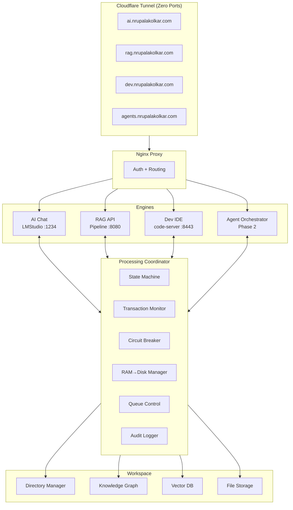
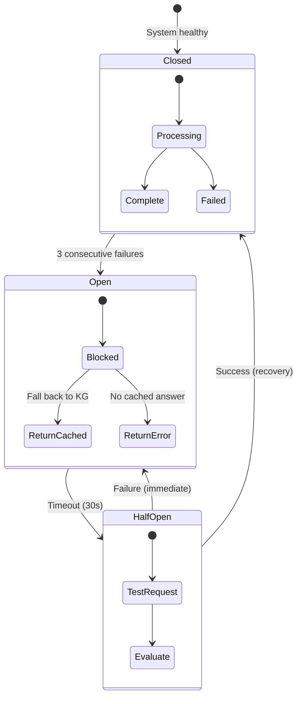
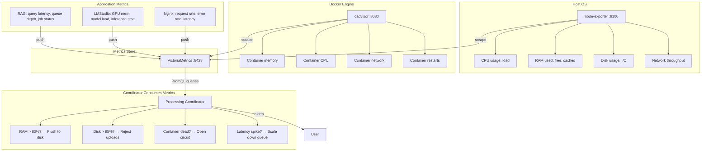
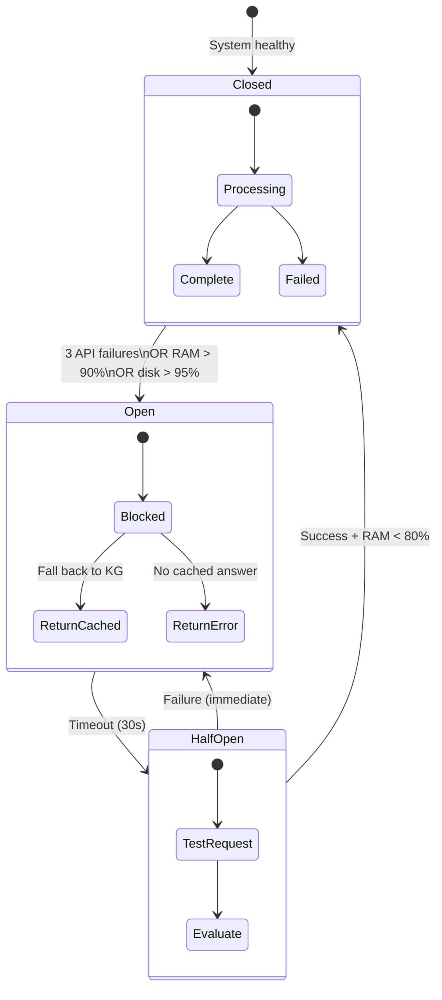
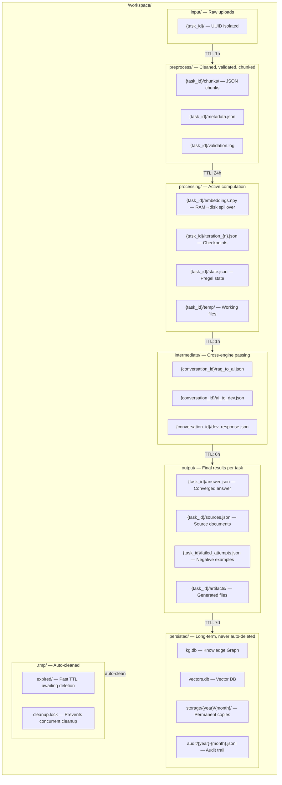
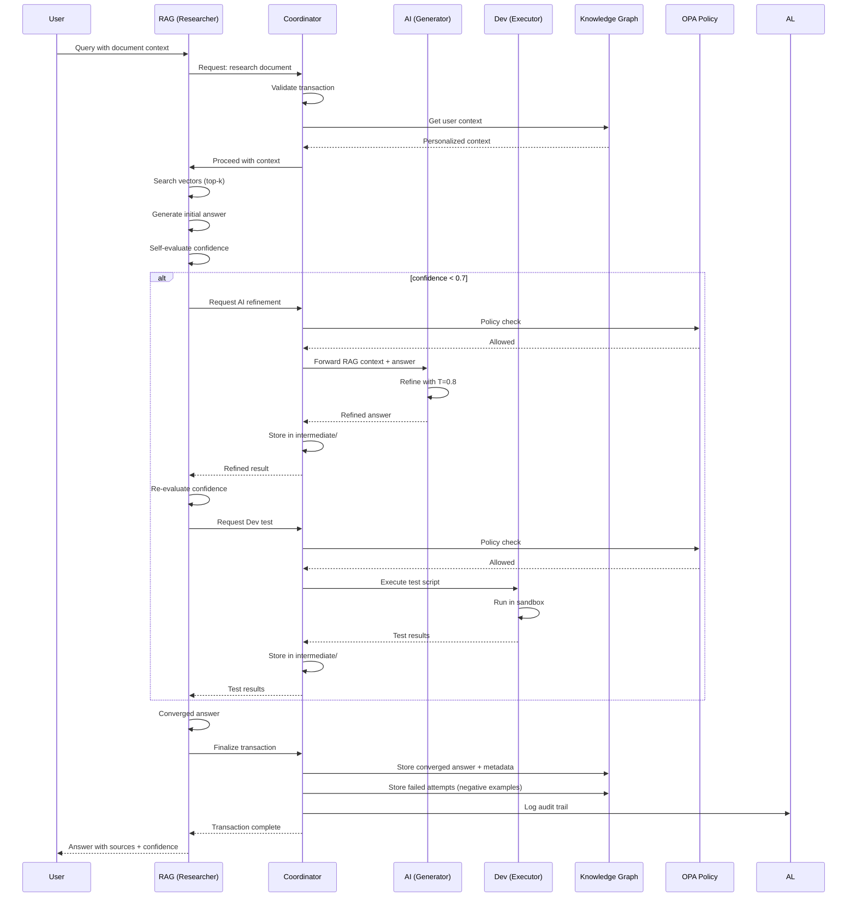
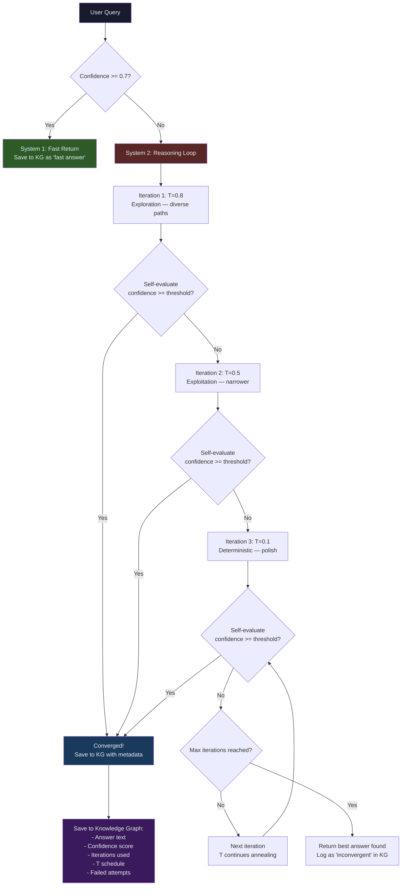
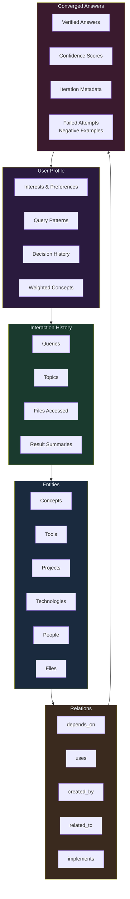
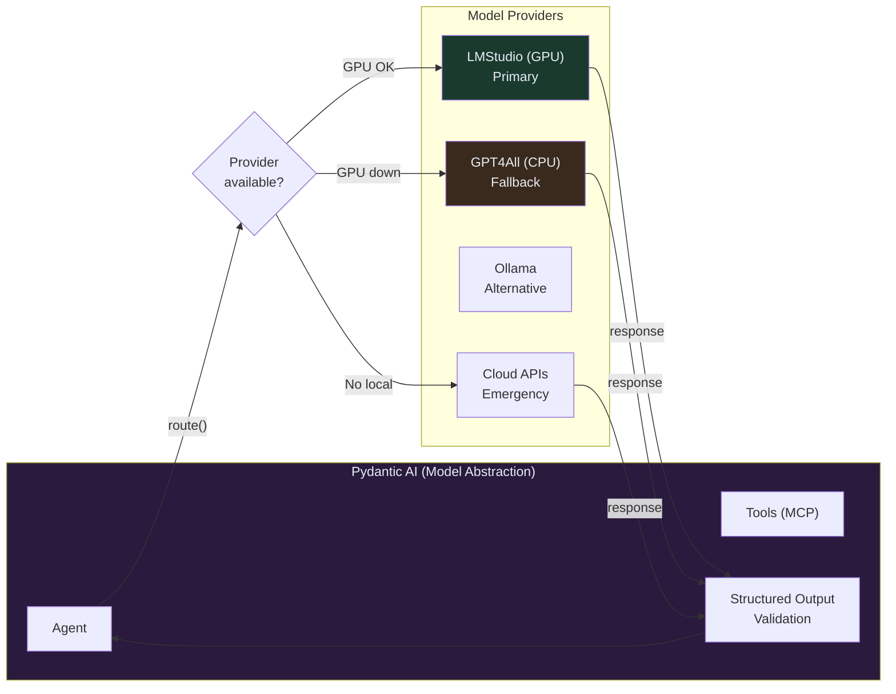

# AETHERIS — Production Build Plan v4.0
## Sovereign AI-Native Personal Cloud + Agentic Intelligence Layer

**Project Status:** IN PROGRESS
**Architecture Type:** Containerized Zero-Trust Mesh + Agentic Orchestration
**Security Philosophy:** Deceptive, Persistent, and Air-Gapped Intelligence
**Target Platform:** Containerized Bare Metal Emulation → OCI ARM → Cloudflare Tunnel
**Build Mode:** API-First, Zero-Trust, Zero-Knowledge
**Last Updated:** 2026-05-03

---

## 1. CORE TECHNICAL STACK

| Layer | Technology | Version | Purpose |
|-------|------------|---------|---------|
| **Runtime** | Rust | 1.75+ | Static MUSL binary orchestrator |
| **Container** | Docker Compose | Latest | Containerized deployment |
| **Base Image** | Alpine/Distroless | Latest | Minimal attack surface |
| **Networking** | WireGuard | UDP 51820 | L3 encrypted mesh tunnel |
| **Security** | Open Policy Agent (OPA) | Latest | Zero-trust authorization |
| **Storage** | ZFS | AES-256-GCM | Native encrypted filesystem |
| **AI Inference (Primary)** | LMStudio | OpenAI-compatible | GPU-accelerated LLM inference |
| **AI Inference (Fallback)** | GPT4All | CPU-optimized | GGUF CPU inference when GPU unavailable |
| **Model Abstraction** | Pydantic AI | MIT, Latest | Model-agnostic agent framework, provider swapping |
| **Vector DB** | SQLite + NumPy | Custom | Semantic file indexing, brute-force cosine sim |
| **Metrics Store** | VictoriaMetrics | Latest | Time-series database |
| **Host Metrics** | node-exporter | Latest | CPU, RAM, disk, network metrics |
| **Container Metrics** | cadvisor | Latest | Per-container memory, CPU, restarts, I/O |
| **Web Proxy** | Nginx | Alpine | Reverse proxy + auth |
| **Tunnel** | Cloudflare Tunnel | Latest | Zero inbound ports |
| **RAG Engine** | FastAPI + Python 3.11 | Custom | Retrieval-Augmented Generation |

---

## 2. SYSTEM ARCHITECTURE — OVERVIEW

---

## 3. PROCESSING COORDINATOR — THE GOVERNOR

**Purpose**: Single point of control for all data passing between engines. Without it, engines operate blindly — no rollback, no state tracking, no circuit breaking.

### 3.1 Core Responsibilities

| Function | What It Does | Why It Matters |
|----------|-------------|----------------|
| **Transaction Monitor** | Tracks every request→response lifecycle across engines | Knows if transaction completed, failed, or in-flight |
| **State Machine** | Enforces valid state transitions (queued→processing→completed or failed) | Prevents invalid operations, enables resume on crash |
| **Error Handler** | Catches failures, classifies (transient vs permanent), triggers retry or escalation | Graceful degradation instead of silent data loss |
| **Circuit Breaker** | Tracks engine health. Opens circuit after N failures. Half-opens to test recovery | Prevents cascading failures when engine is down |
| **RAM→Disk Manager** | Flushes intermediate data to disk when RAM > 80% threshold | Prevents OOM crashes on memory-constrained hosts |
| **Queue Depth Control** | Limits concurrent operations per engine. Backpressure when queue full | Prevents engine overload, maintains responsiveness |
| **Audit Logger** | Logs every transaction: who, what, when, source, result, duration | Full traceability for debugging and compliance |
| **Cleanup Scheduler** | Deletes expired intermediate files (TTL-based). Runs every 5 minutes | Prevents disk fill from abandoned temp data |

---

## 4. OBSERVABILITY — MONITORING LAYER

**Purpose**: Real-time visibility into host resources, container health, and engine performance. Feeds the Coordinator so it makes decisions based on actual system state, not guesses.

### 4.1 Metrics Collected

| Source | Metric | Alert Threshold | Coordinator Action |
|--------|--------|-----------------|-------------------|
| node-exporter | `node_memory_MemAvailable_bytes` | < 2GB | Open circuit, reject new jobs |
| node-exporter | `node_filesystem_avail_bytes{mountpoint="/"}` | < 5GB | Reject uploads, trigger cleanup |
| node-exporter | `node_load1` | > 4 OCPU | Scale down queue to 2 |
| cadvisor | `container_memory_working_set_bytes{rag}` | > 2GB | Kill heavy jobs, flush RAM |
| cadvisor | `container_last_seen{rag}` | Missing for 30s | Open circuit, mark engine dead |
| cadvisor | `container_restart_count{rag}` | > 0 | Log incident, investigate |
| RAG API | Query latency (p95) | > 60s | Reduce queue depth |
| RAG API | Job queue depth | > 5 | Return 503 (backpressure) |
| RAG API | Embedding failures | > 3 in 5 min | Check LMStudio health |

### 4.2 Alert Channels

| Severity | Condition | Action |
|----------|-----------|--------|
| **Critical** | RAM < 1GB OR disk < 2GB | Kill all processing jobs, trigger cleanup, open all circuits |
| **Warning** | RAM < 3GB OR disk < 5GB | Reduce queue depth, flush RAM, notify user |
| **Info** | Container restart OR latency spike | Log to audit trail, no user disruption |

### 4.3 Circuit Breaker — Enhanced with Monitoring

**Triggers for opening circuit**:
- 3 consecutive API failures to an engine
- Host RAM > 90% (coordinator prevents new requests)
- Host disk > 95% (coordinator prevents new uploads)
- Container health check fails 2x

---

## 5. DIRECTORY ARCHITECTURE — STRICT SEPARATION

**TTL Rules**:
| Directory | TTL | Rationale |
|-----------|-----|-----------|
| `/workspace/input/{task_id}/` | 1 hour after processing starts | Raw upload no longer needed after preprocessing |
| `/workspace/preprocess/{task_id}/` | 24 hours after completion | Chunks may be needed for re-embedding |
| `/workspace/processing/{task_id}/` | 1 hour after completion | Intermediate computation artifacts |
| `/workspace/intermediate/{conversation_id}/` | 6 hours after last message | Cross-engine message cache |
| `/workspace/output/{task_id}/` | 7 days (user extensible) | User needs time to review results |
| `/workspace/.tmp/` | 30 minutes | Transient scratch space |
| `/workspace/persisted/` | Never auto-deleted | Permanent knowledge and audit records |

---

## 5. INTER-ENGINE A2A PROTOCOL + MCP LAYER

### 5.1 Collaboration Patterns

| Pattern | Flow | Use Case |
|---------|------|----------|
| **Sequential** | RAG → AI → Dev | Research → Generate → Test |
| **Delegative** | AI delegates to RAG for grounding | LLM doesn't know → queries docs |
| **Consensus** | RAG + AI both answer → compare | Verify factual accuracy |
| **Critique Loop** | Dev generates → AI reviews → Dev fixes | Code quality |
| **Broadcast** | All engines receive context | System-wide awareness |

---

## 6. REASONING LOOP WITH MATHEMATICAL CONVERGENCE

**Hybrid Verification (fallback chain)**:
1. LLM self-evaluation (always available)
2. RAG source grounding (when documents uploaded)
3. Consistency across temperature schedule (always available)

If one is unavailable, the next takes over. Never blocks.

---

## 7. KNOWLEDGE GRAPH — UNIVERSAL INTELLIGENCE LAYER

**Accessible by**: AI Chat, RAG, Dev, OPA, Agent — all read the same graph. Every engine personalizes its response based on who you are.

---

## 8. MODEL ABSTRACTION — PYDANTIC AI + FALLBACK

**GPT4All role**: CPU-only fallback inference. Activated automatically when LMStudio is unavailable. Uses same GGUF models. Slower but keeps system functional. No GPU required.

---

## 9. GAP ANALYSIS — FAILURE MODES & PREVENTIONS

| # | Failure Mode | How It Happens | What Prevents It |
|---|-------------|----------------|------------------|
| **1** | OOM on large file processing | File loaded entirely into RAM, embeddings add 4x multiplier | Coordinator RAM→Disk Manager flushes at 80%. Streaming chunk-by-chunk. Max 50MB upload. |
| **2** | Transaction lost mid-engine-call | RAG calls AI, AI crashes, response never returned | Coordinator Transaction Monitor tracks in-flight. Timeout → retry → escalate. State on disk. |
| **3** | Directory collisions / overwrites | Two concurrent uploads write to same path | UUID-isolated directories. Every task gets `{task_id}/`. Never overlaps. |
| **4** | Queue overflow (backpressure) | Fast uploads, slow embedding, queue grows unbounded | Coordinator Queue Depth Control: max 5 concurrent per engine. HTTP 503 when full. |
| **5** | Reasoning loop state loss on crash | Container restarts mid-iteration | Pregel Checkpointing: state saved to `/workspace/processing/{id}/state.json` after each node. Resume. |
| **6** | A2A message loss | Engine A sends to B, B crashes, message lost | Coordinator as message broker: at-least-once delivery. Persisted to `/workspace/intermediate/`. Replay on recovery. |
| **7** | Cascading engine failure | AI down, RAG keeps retrying, all hang | Circuit Breaker: opens after 3 failures. Returns cached KG answer immediately. Half-opens after 30s. |
| **8** | Disk fill from abandoned temp data | Intermediate files persist forever | Coordinator Cleanup Scheduler: TTL-based deletion every 5 min. Audit trail logs deletions. |
| **9** | No audit trail for debugging | Something fails, no way to trace | Coordinator Audit Logger: every transaction logged to `/workspace/persisted/audit/`. JSONL format. |
| **10** | Concurrency conflicts on KG | Two queries update KG simultaneously | Coordinator manages locks. SQLite WAL for reads. Writes serialized through queue. |
| **11** | Reasoning loop infinite iteration | Confidence never reaches threshold | Hard limit: max 10 iterations. Force-return best answer. Log as "inconvergent" in KG. |
| **12** | Stale engine connections | Coordinator holds dead connection | Health checks every 10s. Dead connections closed. Re-register on reconnect. |
| **13** | Corrupted intermediate data | Partial write during crash | Atomic writes: write to `.tmp` then `rename()`. On startup, delete stale `.tmp` files. |
| **14** | Unauthorized cross-engine access | Dev calls AI without policy check | OPA gate on every A2A call. Coordinator validates policy before routing. |
| **15** | Primary inference engine unavailable | LMStudio crashes, GPU driver fails | Pydantic AI auto-fails to GPT4All (CPU). No code changes. Same API contract. |
| **16** | Model provider total outage | All local inference down | Pydantic AI routes to cloud API (emergency mode). User notified. |

---

## 10. MCP SPECIFICATION — IMPLEMENTATION DETAILS

**Protocol**: JSON-RPC 2.0 over stdio (local) or SSE (remote). Three primitives:
- **Tools**: State-changing functions the agent can call
- **Resources**: Read-only data sources (documents, configs, KG queries)
- **Prompts**: Templated workflows for users

**Cloudflare "Code Mode" pattern**: Instead of 2,500 narrow tools, expose 2 broad tools (`search()` to explore, `execute()` to run). Fixed ~1,000 token footprint regardless of API surface.

**OPA enforcement**: Every MCP tool call validated against OPA policies before execution.

**McpSafetyScanner mitigation** (arXiv 2504.03767): All MCP tools run in sandboxed containers. No host filesystem access. Credentials never passed in tool payloads.

---

## 11. BUILD PHASES

### Phase 1 — Reasoning Loop + Coordinator in RAG (Current)
| # | Task | Status |
|---|------|--------|
| **1.21** | **Add monitoring stack** — node-exporter + cadvisor → VictoriaMetrics. Coordinator queries metrics for RAM→Disk and circuit breaker decisions | ✅ Done (compose.yaml updated) |
| **1.22** | **App Performance Monitor** — query latency (p50/p95/p99), error rates, throughput, token consumption, cache effectiveness, anomaly detection, rolling session records | ✅ Done (coordinator.py) |
| **1.23** | **System Event Logger** — structured lifecycle events (startup, engine health, config changes, user activity, security), categorized and queryable like OS event viewer | ✅ Done (coordinator.py) |
| **1.24** | **Self-Evaluator** — post-session analysis using KG: answer quality scoring, confidence trends, efficiency metrics, knowledge growth, failure pattern detection, auto-suggestions for parameter tuning | ✅ Done (coordinator.py) |
| **1.25** | **Session Management** — start/end session tracking, per-session query logging, automatic self-evaluation on session end, historical session comparison | ✅ Done (coordinator.py + rag_cli.py) |
| **1.26** | **UI updates** — reasoning toggle, iteration slider, confidence threshold, circuit breaker badges, KG tab with entity/relation viewer | ✅ Done (web/rag/index.html) |
| **1.27** | **Query endpoint** — add reasoning/max_iterations/confidence_threshold params, return reasoning_trace/confidence/converged | ✅ Done (rag_cli.py) |
| **1.28** | **Ingest with KG extraction** — extract_entities flag on file upload, KG stats in response | ✅ Done (rag_cli.py + pipeline.py) |

### Phase 2 — Agent Orchestrator (agents.nrupalakolkar.com)
| # | Task | Status |
|---|------|--------|
| 2.1 | New project: FastAPI agent orchestrator with Pydantic AI | ✅ Done (agent_orchestrator/) |
| 2.2 | MCP Server: tool registry (Code Mode pattern), resource server, prompt templates | ✅ Done (mcp/server.py, tools.py, prompts.py) |
| 2.3 | A2A protocol: RAG↔AI↔Dev bidirectional communication | ✅ Done (a2a_gateway.py with OPA gate) |
| 2.4 | Multi-agent roles: researcher, coder, reviewer, planner | ✅ Done (agents/base.py) |
| 2.5 | Agent uses RAG (with reasoning loop) as primary tool | ⬜ Planned |
| 2.6 | Agent reads/writes Knowledge Graph for context | ⬜ Planned |
| 2.7 | OPA policy checks before every agent action | ⬜ Planned (gateway stub) |
| 2.8 | Zero-JS UI: dashboard, task history, graph viewer, collaboration feed | ⬜ Planned |

### Phase 3 — Cross-System Orchestration
| # | Task | Status |
|---|------|--------|
| 3.1 | Synchronized state management across all 4 engines | ✅ Done (cross_system.py: CrossEngineState with SQLite-backed WAL) |
| 3.2 | Resource forecasting: predict which engine needed, pre-warm | ✅ Done (cross_system.py: ResourceForecaster with linear regression) |
| 3.3 | Shared Knowledge Graph as single source of truth | ✅ Done (cross_system.py: SharedKGHub with per-engine permissions) |
| 3.4 | Accurate spread forecasting for resource allocation | ✅ Done (cross_system.py: SpreadForecaster with bottleneck detection) |

---

## 12. CURRENT DOCKER STACK

| Container | Image | Status | Port |
|-----------|-------|--------|------|
| `llmvm_rag` | Custom FastAPI | Running | 8080 |
| `llmvm_dev` | code-server | Running | 8443 |
| `llmvm_nginx` | Nginx Alpine | Running | 80 (internal) |
| `llmvm_tunnel` | Cloudflared | Running | - |
| `aetheris_vectors` | ChromaDB | Running | 8000 |
| `aetheris_opa` | OPA | Running | 8181 |
| `aetheris_stats` | VictoriaMetrics | Running | 8428 |
| `aetheris_node_exporter` | prom/node-exporter | Added to compose.yaml | 9100 (internal) |
| `aetheris_cadvisor` | gcr.io/cadvisor/cadvisor | Added to compose.yaml | 8080 (internal) |
| `aetheris_orchestrator` | Custom FastAPI | Added to compose.yaml (Phase 2) | 9090 |

---

## 13. DESIGN DECISIONS

| Decision | Rationale |
|----------|-----------|
| Processing Coordinator | Prevents silent data loss, cascading failures, untracked transactions |
| RAM→Disk spillover at 80% | Host has 15GB RAM, ~2.4GB free — OOM is #1 risk |
| Strict directory separation | UUID isolation prevents all collision/overwrite scenarios |
| Pregel checkpointing | Inspired by LangGraph — deterministic execution with crash recovery |
| Circuit breaker pattern | Prevents hanging requests when engines are down |
| TTL-based cleanup | Prevents disk fill from abandoned intermediate data |
| Confidence gate (default 0.7) | Skip reasoning loop for high-confidence answers (Kahneman System 1) |
| Max 3 iterations default | Research sweet spot (MAgICoRe, SCoRe). More causes over-correction |
| Temperature annealing 0.8→0.5→0.1 | High T for exploration, low T for convergence (Hegelian Dialectic) |
| Hybrid verification fallback | Never blocks if one verifier is unavailable |
| KG stores failed attempts | Negative examples improve future reasoning (STaSC) |
| Pydantic AI for model abstraction | Model-agnostic, MIT, structured outputs, MCP support, provider swap |
| GPT4All as CPU fallback | Keeps system functional when LMStudio/GPU unavailable |
| A2A with CrewAI-inspired roles | Each engine has a role; collaboration patterns are explicit |
| OPA on every A2A call | Zero-trust: even internal engine calls need authorization |
| Phase 1 before Phase 2 | RAG exists now. Prove the pattern. Agent builds on proven foundation |
| Self-Evaluation post-session | Zero runtime cost; uses KG for historical comparison and continuous improvement |
| App Performance Monitor | SQLite-backed analytics with anomaly detection; equivalent to OS performance monitors |
| System Event Logger | Structured, categorized event logging for app lifecycle tracking |
| Session Management | Enables per-session evaluation, historical comparison, and degradation detection |
| node-exporter + cAdvisor | Host + container metrics → VictoriaMetrics; Coordinator queries for resource decisions |
| Agent Orchestrator MCP Server | Standardized tool/resource/prompt interface for all agents; Linux Foundation MCP spec |
| Multi-agent role separation | Researcher/Coder/Reviewer/Planner — each with specialized system prompts and model assignments |
| A2A Gateway with file bus | Conversation-scoped message directories with TTL cleanup and OPA policy gate |
| RAG UI reasoning controls | Toggle + iteration slider + confidence threshold — user-controlled depth of analysis |

---

## 14. REFERENCES & RESEARCH

| Source | Type | Key Insight | Adopted? |
|--------|------|-------------|----------|
| [MCP Spec](https://modelcontextprotocol.io/specification/latest) (Anthropic, 2024) | Protocol | JSON-RPC 2.0 standardization for AI-tool integration, Linux Foundation governance | Yes — Phase 2 |
| [McpSafetyScanner](https://arxiv.org/abs/2504.03767) (arXiv 2504.03767, 2025) | Security Paper | MCP tools can be coerced into credential theft and code execution | Yes — OPA gate on all MCP calls |
| [ReVISE](https://arxiv.org/abs/2502.14565) (arXiv 2502.14565, 2025) | Research | Self-verification at test-time with confidence-aware decoding | Yes — hybrid verification |
| [MAgICoRe](https://arxiv.org/abs/2409.12147) (arXiv 2409.12147, 2024) | Research | Multi-agent iterative coarse-to-fine refinement beats self-consistency by 3.4% | Yes — reasoning loop |
| [Hegelian Dialectic Self-Reflection](https://arxiv.org/abs/2501.14917) (arXiv 2501.14917, 2025) | Research | Dynamic temperature annealing: high creativity early, low for convergence | Yes — T schedule 0.8→0.5→0.1 |
| [Reflexion + UTD](https://openreview.net/pdf?id=AbO4lCvlo3) (OpenReview, 2025) | Research | Uncertainty-Triggered Deliberation — deliberate only when uncertain | Yes — confidence gate |
| [SCoRe](https://openreview.net/pdf?id=pTyEnkuSQ0) (ICLR 2025) | Research | Self-correction via multi-turn RL, sequential scaling beyond parallel sampling | Yes — iteration pattern |
| [STaSC](https://arxiv.org/abs/2503.08681) (arXiv 2503.08681, 2025) | Research | Self-Taught Self-Correction — failed paths improve future reasoning | Yes — store failed attempts in KG |
| [LangGraph](https://blog.langchain.com/building-langgraph/) (LangChain, 2025) | Framework Blog | Pregel-inspired checkpointing for durable execution, state persistence | Yes — checkpointing pattern |
| [Multi-Agent Orchestration](https://arxiv.org/abs/2601.13671) (arXiv 2601.13671, 2026) | Research | MCP + A2A dual protocol for tool access and peer coordination | Yes — both adopted |
| [Pydantic AI](https://github.com/pydantic/pydantic-ai) (MIT, 2024) | OSS Framework | Model-agnostic agent framework, type-safe tools, MCP support, 16.7K stars | Yes — model abstraction |
| [GPT4All API Server](https://docs.gpt4all.io/gpt4all_api_server/home.html) (Nomic, 2024) | Documentation | CPU-optimized GGUF inference, OpenAI-compatible, LocalDocs RAG | Yes — fallback inference |
| [Cloudflare Code Mode MCP](https://web4agents.org/en/docs/mcp) (2026) | Documentation | Fewer broad tools beat many narrow tools for token efficiency | Yes — Code Mode pattern |
| [Pregel](https://kowshik.github.io/JPregel/pregel_paper.pdf) (Google, 2010) | Research Paper | Distributed graph processing with deterministic concurrency + loop support | Yes — checkpointing algorithm |

---

## 15. EMERGENCY FEATURES

- **Ghost Shell**: High-interaction honeypot
- **Kill-Switch**: Scorched Earth Protocol
- **Zero-Trust**: OPA-based authorization
- **ZFS Encryption**: AES-256-GCM native key management
- **WireGuard Stealth**: No ICMP, invisible to port scans

---

**Last Updated:** 2026-05-03
**Next Action:** Awaiting user consent to execute Phase 1 items 1.11-1.20
