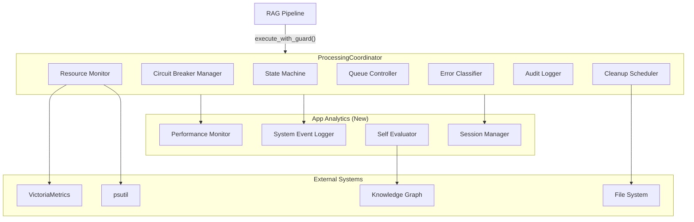
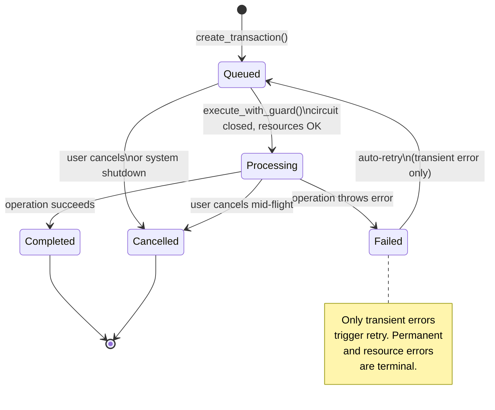
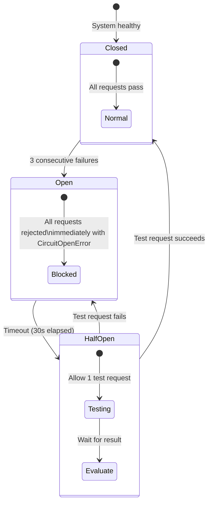
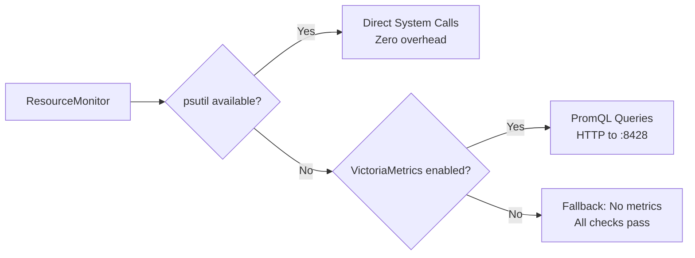
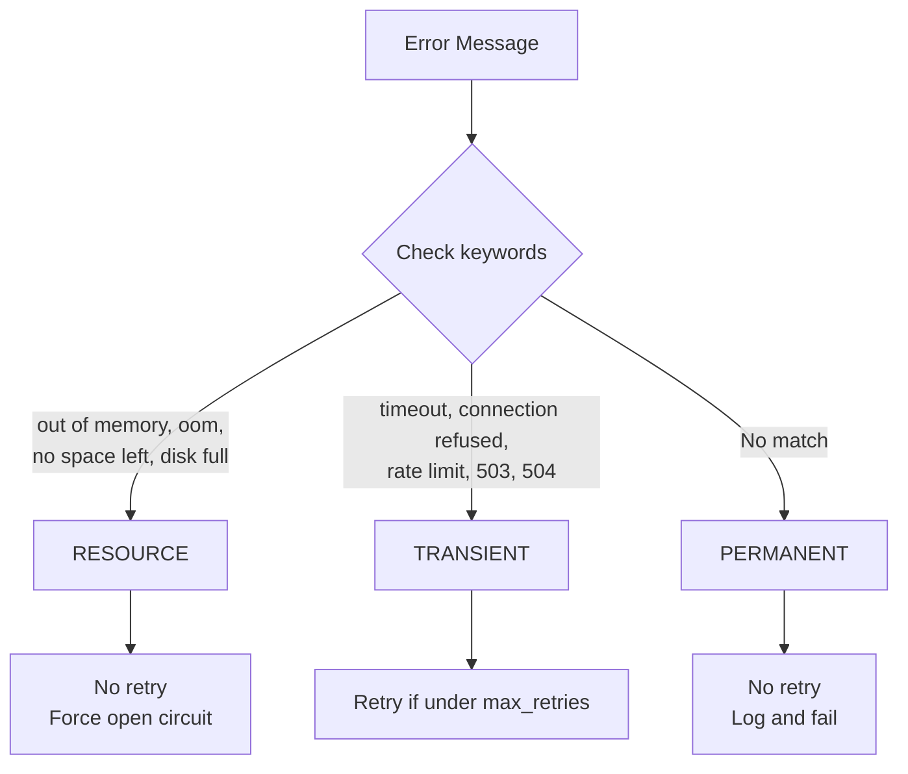
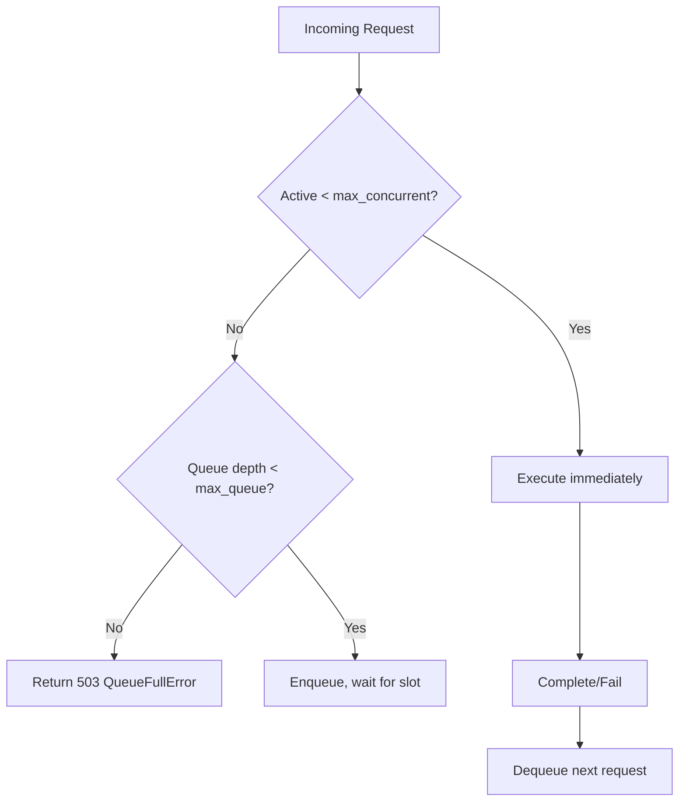
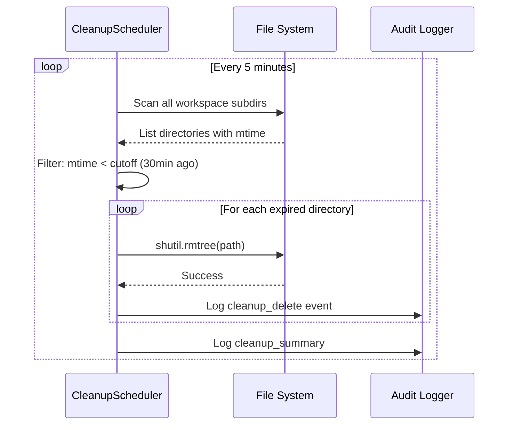
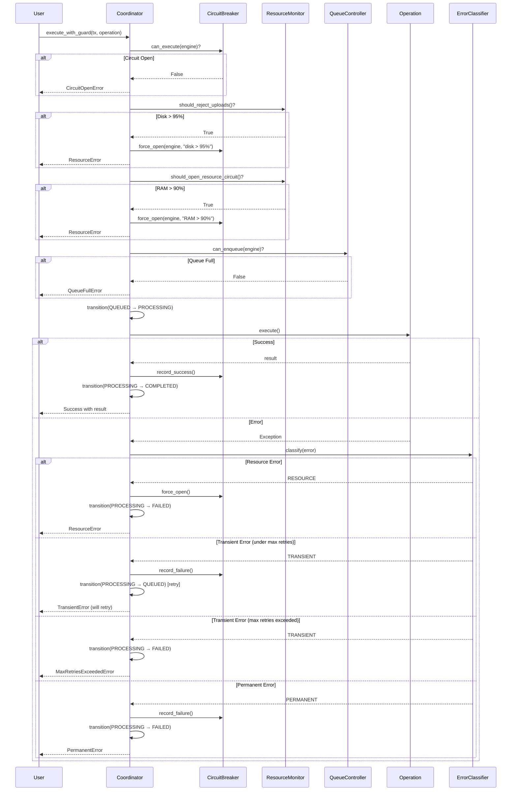

# Processing Coordinator — Architecture & Design

## Overview

The Processing Coordinator is the central governance layer for all RAG pipeline operations. It prevents silent data loss, cascading failures, and untracked transactions by enforcing state machines, circuit breakers, resource limits, and full audit trails.

**Location**: `rag_core/coordinator.py`  
**Pattern**: Centralized governance with pluggable subsystems  
**Dependencies**: SQLite (transactions, audit), psutil OR VictoriaMetrics (resources)

---

## System Architecture



---

## Subsystem Breakdown

### 1. State Machine

Enforces valid transaction state transitions. Prevents invalid operations like completing an already-completed transaction or retrying a permanently-failed one.



**Valid Transitions Table**:

| From State | Valid To States | Trigger |
|------------|----------------|---------|
| `QUEUED` | `PROCESSING` | `execute_with_guard()` passes all checks |
| `QUEUED` | `CANCELLED` | User cancels or system shutdown |
| `PROCESSING` | `COMPLETED` | Operation returns successfully |
| `PROCESSING` | `FAILED` | Operation throws exception |
| `PROCESSING` | `CANCELLED` | User cancels mid-flight |
| `FAILED` | `QUEUED` | Auto-retry (transient error only, under max retries) |
| `COMPLETED` | *(none)* | Terminal state |
| `CANCELLED` | *(none)* | Terminal state |

**Implementation**:

```python
VALID_TRANSITIONS = {
    TransactionState.QUEUED: {TransactionState.PROCESSING, TransactionState.CANCELLED},
    TransactionState.PROCESSING: {TransactionState.COMPLETED, TransactionState.FAILED, TransactionState.CANCELLED},
    TransactionState.COMPLETED: set(),
    TransactionState.FAILED: {TransactionState.QUEUED},
    TransactionState.CANCELLED: set(),
}
```

---

### 2. Circuit Breaker Manager

Protects against cascading failures when an engine is down. Each engine (rag, ai, dev) has its own independent circuit breaker.



**Circuit Breaker States**:

| State | Behavior | Duration |
|-------|----------|----------|
| `CLOSED` | Normal operation, all requests pass | Until 3 consecutive failures |
| `OPEN` | All requests rejected immediately with `CircuitOpenError` | 30 seconds (configurable) |
| `HALF_OPEN` | Allow 1 test request to check recovery | Until success or failure |

**Configuration**:

```python
@dataclass
class CircuitBreaker:
    engine: str
    state: CircuitState = CircuitState.CLOSED
    failure_count: int = 0
    failure_threshold: int = 3        # Trip after 3 failures
    timeout_seconds: float = 30.0     # Wait 30s before testing recovery
    half_open_max: int = 1            # Only 1 test request allowed
```

**Resource-Triggered Circuit Opening**:

Beyond API failures, circuits can be forced open by resource constraints:

| Condition | Threshold | Action |
|-----------|-----------|--------|
| RAM usage | > 90% | Force open all circuits |
| Disk usage | > 95% | Force open all circuits |
| Container health check | 2 consecutive failures | Force open specific circuit |

---

### 3. Resource Monitor

Monitors host resources using two backends (auto-selected):



**Backend Selection Priority**:

1. **psutil** (preferred) — Direct system calls, zero network overhead
2. **VictoriaMetrics** (fallback) — HTTP PromQL queries to metrics endpoint
3. **None** (degraded) — All resource checks pass (unsafe, logged)

**Thresholds & Actions**:

| Metric | Warning Threshold | Critical Threshold | Action |
|--------|------------------|-------------------|--------|
| RAM usage | > 80% | > 90% | 80%: Flush to disk. 90%: Open circuit, reject operations |
| Disk usage | > 85% | > 95% | 85%: Trigger cleanup. 95%: Reject uploads |
| Load average | > 4 OCPU | > 8 OCPU | 4: Reduce queue to 2. 8: Reject new jobs |

**ResourceSnapshot Structure**:

```python
@dataclass
class ResourceSnapshot:
    ram_available_mb: float = 0      # Available RAM in MB
    ram_total_mb: float = 0          # Total RAM in MB
    ram_percent_used: float = 0      # 0.0 - 1.0
    disk_free_gb: float = 0          # Free disk space in GB
    disk_total_gb: float = 0         # Total disk space in GB
    disk_percent_used: float = 0     # 0.0 - 1.0
    load_1: float = 0                # 1-minute load average
    timestamp: str = ""              # ISO 8601
```

---

### 4. Error Classifier

Automatically classifies errors to determine retry behavior:



**Error Classification Table**:

| Type | Retry? | Circuit Impact | Examples |
|------|--------|---------------|----------|
| `TRANSIENT` | Yes (up to max_retries) | Records failure, opens after threshold | Timeout, connection refused, rate limit, 503, 504 |
| `PERMANENT` | No | Records failure, opens after threshold | Auth failure, invalid input, 400, 401, 404 |
| `RESOURCE` | No | Force open immediately | Out of memory, disk full, cannot allocate memory |

---

### 5. Queue Controller

Limits concurrent operations per engine and enforces backpressure:



**Default Limits**:

| Parameter | Default | Rationale |
|-----------|---------|-----------|
| `max_concurrent_per_engine` | 2 | Host has 15GB RAM, ~2.4GB free — prevent OOM |
| `max_queue_depth` | 5 | Beyond 5, user should retry later |

---

### 6. Audit Logger

Append-only JSONL audit log, one file per month:

```
/workspace/persisted/audit/
├── 2026-05.jsonl    # Current month
├── 2026-04.jsonl    # Previous month
└── ...
```

**Log Entry Format**:

```json
{
  "timestamp": "2026-05-03T14:32:15.123456",
  "event": "transaction_completed",
  "tx_id": "abc-123-def",
  "engine": "rag",
  "user": "rag_user",
  "details": {"from": "processing", "to": "completed", "error": null}
}
```

**Events Logged**:

| Event | When | Details |
|-------|------|---------|
| `coordinator_init` | Coordinator starts | Config values |
| `transaction_created` | New transaction | Input keys |
| `transition_*` | State change | From/to state, error |
| `circuit_blocked` | Request blocked by circuit | Engine name |
| `retry_scheduled` | Transient error, retry queued | Retry count |
| `cleanup_delete` | Expired directory removed | Path, age |
| `self_evaluation` | Session evaluated | Scores, suggestions |

---

### 7. Cleanup Scheduler

TTL-based background cleanup of workspace directories:



**TTL Configuration**:

| Directory | TTL | Rationale |
|-----------|-----|-----------|
| `input/` | 1 hour | Raw uploads should be processed quickly |
| `preprocess/` | 24 hours | May be needed for re-processing |
| `processing/` | 1 hour | Active computation should complete fast |
| `intermediate/` | 6 hours | Cross-engine data may need time |
| `output/` | 7 days | Final results kept for review |
| `.tmp/` | 30 minutes | Temporary files, auto-clean |

**Cleanup Lock**: Prevents concurrent cleanup runs via `.tmp/cleanup.lock`.

---

## Usage Examples

### Basic Usage

```python
from rag_core.coordinator import get_coordinator, CircuitOpenError, ResourceError

coordinator = get_coordinator()
coordinator.start()

# Create and execute a transaction
tx = coordinator.create_transaction("rag", {"query": "What is WireGuard?"})

try:
    tx = coordinator.execute_with_guard(tx, lambda: pipeline.query("What is WireGuard?"))
    print(f"Answer: {tx.output_data['result']}")
except CircuitOpenError as e:
    print(f"Circuit breaker open: {e}")
except ResourceError as e:
    print(f"Resource constraint: {e}")
except Exception as e:
    print(f"Operation failed: {e}")

coordinator.stop()
```

### Session Management with Self-Evaluation

```python
# Start session
session_id = coordinator.start_session()

# Process queries (tracked automatically)
for question in ["What is X?", "How does Y work?"]:
    try:
        tx = coordinator.create_transaction("rag", {"query": question})
        result = pipeline.query(question)
        coordinator.record_query_result(
            query=question,
            success=True,
            confidence=result.get("confidence", 0),
            iterations=result.get("iterations", 1),
            latency_ms=tx.duration_ms,
            tokens_out=result.get("tokens_used", 0),
        )
    except Exception as e:
        coordinator.record_query_result(
            query=question,
            success=False,
            error=str(e),
        )

# End session (auto-evaluates if KG attached)
report = coordinator.end_session()
if report:
    print(f"Overall score: {report['scores']}")
    for suggestion in report['suggestions']:
        print(f"  [{suggestion['priority']}] {suggestion['suggestion']}")
```

### Performance Dashboard

```python
dashboard = coordinator.get_performance_dashboard()
print(f"Latency p95 (5min): {dashboard['latency']['5min']['p95']}ms")
print(f"Error rate (1hr): {dashboard['errors']['1hour']['error_rate']}")
print(f"Throughput: {dashboard['throughput']['queries_per_minute']} queries/min")
print(f"Cache hit rate: {dashboard['cache']['hit_rate']}")
```

---

## Error Handling Flow



---

## Thread Safety

All subsystems are thread-safe:

| Subsystem | Lock Mechanism | Scope |
|-----------|---------------|-------|
| `CircuitBreakerManager` | `threading.Lock` | Per-breaker operations |
| `TransactionStore` | `threading.Lock` | All DB operations |
| `QueueController` | `threading.Lock` | Enqueue/dequeue |
| `AuditLogger` | `threading.Lock` | File writes |
| `ResourceMonitor` | None needed | Read-only, stateless |
| `AppPerformanceMonitor` | `threading.Lock` | All DB operations |
| `SystemEventLogger` | `threading.Lock` | All DB operations |
| `SelfEvaluator` | `threading.Lock` | Evaluation runs |

---

## Database Schema

### Transaction Store (`transactions.db`)

```sql
CREATE TABLE transactions (
    id TEXT PRIMARY KEY,
    engine TEXT NOT NULL,
    state TEXT NOT NULL,              -- queued, processing, completed, failed, cancelled
    created_at TEXT NOT NULL,
    updated_at TEXT NOT NULL,
    input_data TEXT DEFAULT '{}',
    output_data TEXT DEFAULT '{}',
    error TEXT,
    error_type TEXT,                  -- transient, permanent, resource
    retry_count INTEGER DEFAULT 0,
    max_retries INTEGER DEFAULT 3,
    metadata TEXT DEFAULT '{}',
    duration_ms REAL DEFAULT 0
);
```

### Performance Metrics (`perf_metrics.db`)

```sql
CREATE TABLE query_metrics (
    id INTEGER PRIMARY KEY AUTOINCREMENT,
    timestamp TEXT NOT NULL,
    engine TEXT NOT NULL,
    latency_ms REAL NOT NULL,
    tokens_in INTEGER DEFAULT 0,
    tokens_out INTEGER DEFAULT 0,
    cache_hit INTEGER DEFAULT 0,
    queue_wait_ms REAL DEFAULT 0,
    success INTEGER DEFAULT 1,
    error_type TEXT
);

CREATE TABLE session_records (
    id INTEGER PRIMARY KEY AUTOINCREMENT,
    session_id TEXT NOT NULL,
    started_at TEXT NOT NULL,
    ended_at TEXT,
    total_queries INTEGER DEFAULT 0,
    successful_queries INTEGER DEFAULT 0,
    failed_queries INTEGER DEFAULT 0,
    total_tokens_in INTEGER DEFAULT 0,
    total_tokens_out INTEGER DEFAULT 0,
    avg_latency_ms REAL DEFAULT 0,
    p95_latency_ms REAL DEFAULT 0,
    p99_latency_ms REAL DEFAULT 0,
    cache_hit_rate REAL DEFAULT 0,
    circuit_trips INTEGER DEFAULT 0,
    resource_events INTEGER DEFAULT 0,
    kg_entities_added INTEGER DEFAULT 0,
    kg_relations_added INTEGER DEFAULT 0
);

CREATE TABLE anomalies (
    id INTEGER PRIMARY KEY AUTOINCREMENT,
    timestamp TEXT NOT NULL,
    metric TEXT NOT NULL,
    value REAL NOT NULL,
    baseline REAL NOT NULL,
    deviation REAL NOT NULL,
    severity TEXT NOT NULL,
    details TEXT DEFAULT '{}'
);
```

### System Events (`system_events.db`)

```sql
CREATE TABLE system_events (
    id INTEGER PRIMARY KEY AUTOINCREMENT,
    timestamp TEXT NOT NULL,
    category TEXT NOT NULL,           -- lifecycle, engine, user, system, security, evaluation
    severity TEXT NOT NULL,           -- info, warning, error, critical
    event_type TEXT NOT NULL,
    source TEXT,
    message TEXT,
    context TEXT DEFAULT '{}',
    session_id TEXT,
    correlation_id TEXT
);
```

---

## Configuration

All settings via `CoordinatorConfig` dataclass or environment variables:

| Config Key | Env Variable | Default | Description |
|------------|-------------|---------|-------------|
| `workspace_root` | `WORKSPACE_ROOT` | `/workspace` | Root directory for all workspace paths |
| `ram_flush_threshold` | — | 0.80 | Flush to disk at 80% RAM |
| `ram_circuit_threshold` | — | 0.90 | Open circuit at 90% RAM |
| `disk_reject_threshold` | — | 0.95 | Reject uploads at 95% disk |
| `disk_cleanup_threshold` | — | 0.85 | Trigger cleanup at 85% disk |
| `max_concurrent_per_engine` | — | 2 | Max concurrent ops per engine |
| `max_queue_depth` | — | 5 | Max queue depth per engine |
| `circuit_failure_threshold` | — | 3 | Trip circuit after N failures |
| `circuit_timeout_seconds` | — | 30.0 | Seconds before testing recovery |
| `metrics_endpoint` | `VMETRICS_URL` | `http://localhost:8428` | VictoriaMetrics URL |
| `metrics_enabled` | `METRICS_ENABLED` | `true` | Enable VictoriaMetrics queries |
| `audit_log_path` | `AUDIT_LOG_PATH` | `/workspace/persisted/audit` | Audit log directory |

---

## Testing

### Unit Tests

```python
def test_circuit_breaker_opens_after_failures():
    config = CoordinatorConfig()
    cb = CircuitBreakerManager(config)
    
    assert cb.can_execute("rag")  # Initially closed
    
    cb.record_failure("rag")
    cb.record_failure("rag")
    assert cb.can_execute("rag")  # Still closed (2 failures)
    
    cb.record_failure("rag")
    assert not cb.can_execute("rag")  # Now open (3 failures)

def test_state_machine_prevents_invalid_transitions():
    coordinator = ProcessingCoordinator()
    tx = coordinator.create_transaction("rag", {"query": "test"})
    
    # Valid: QUEUED → COMPLETED is NOT valid
    with pytest.raises(ValueError):
        coordinator.transition(tx, TransactionState.COMPLETED)
    
    # Valid: QUEUED → PROCESSING
    coordinator.transition(tx, TransactionState.PROCESSING)
```

### Integration Tests

```python
def test_execute_with_guard_full_flow():
    coordinator = ProcessingCoordinator()
    tx = coordinator.create_transaction("rag", {"query": "test"})
    
    tx = coordinator.execute_with_guard(tx, lambda: "result")
    
    assert tx.state == TransactionState.COMPLETED
    assert tx.output_data["result"] == "result"
```

---

## Future Enhancements

| Feature | Status | Description |
|---------|--------|-------------|
| Distributed tracing | Planned | OpenTelemetry integration for cross-service traces |
| Metrics export | Planned | Prometheus metrics endpoint for Grafana dashboards |
| Auto-scaling | Planned | Dynamic queue depth based on resource availability |
| Predictive circuit breaking | Planned | ML-based prediction of engine failures before they happen |
