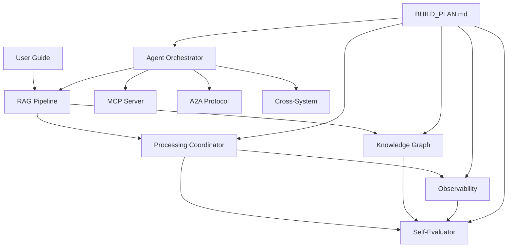
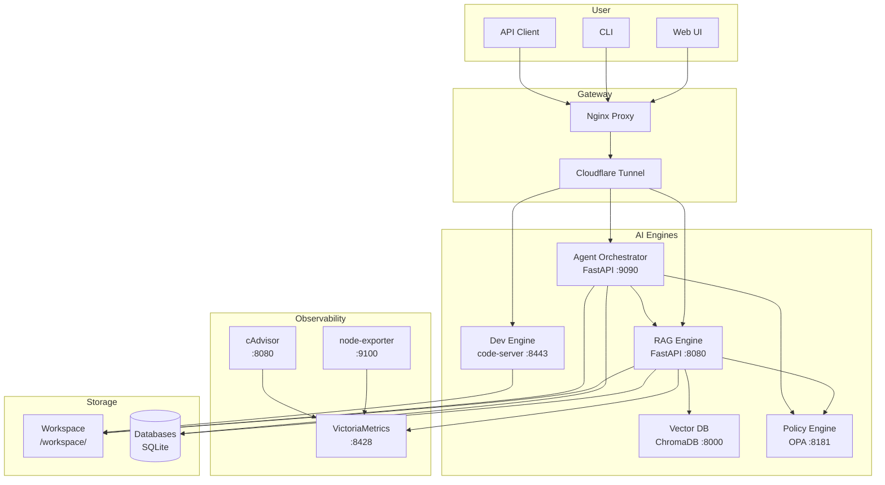

# Documentation Index

Complete documentation for Aetheris v2.0 — Sovereign AI-Native Personal Cloud.

---

## 📚 Documentation

### Getting Started

| Document | Description | Audience |
|----------|-------------|----------|
| [User Guide](USER_GUIDE.md) | How to upload documents, ask questions, manage your knowledge base | All users |
| [RAG Pipeline](RAG_PIPELINE.md) | Complete workflow from upload to answer, with diagrams | Developers, admins |

### Architecture & Design

| Document | Description | Audience |
|----------|-------------|----------|
| [Processing Coordinator](COORDINATOR.md) | State machine, circuit breaker, error handling, audit logging | Developers |
| [Knowledge Graph](KNOWLEDGE_GRAPH.md) | Personal context layer, entity-relation model, query enrichment | Developers |
| [Observability](OBSERVABILITY.md) | Performance monitoring, anomaly detection, system event logging | Developers, ops |
| [Self-Evaluator](SELF_EVALUATOR.md) | Continuous improvement system, session analysis, auto-suggestions | Developers |
| [Agent Orchestrator](AGENT_ORCHESTRATOR.md) | Multi-agent system, MCP server, A2A protocol, cross-system orchestration | Developers |

### Project Management

| Document | Location | Description |
|----------|----------|-------------|
| Build Plan | `BUILD_PLAN.md` | Phase roadmap, gap analysis, task tracking |
| TODO | `TODO.md` | Current work items |
| API Spec | `API_SPEC.md` | REST API reference |
| Test Plan | `TEST_PLAN.md` | Testing strategy |
| Architecture | `ARCHITECTURE.md` | System architecture |
| Requirements | `REQUIREMENTS.md` | Functional requirements |
| Security | `SECURITY.md` | Security considerations |

---

## 🗺️ Documentation Map

---

## 📖 Reading Order

### For New Users
1. [User Guide](USER_GUIDE.md) — Start here
2. [Knowledge Graph](KNOWLEDGE_GRAPH.md) — Understand how the system remembers you

### For Developers
1. [RAG Pipeline](RAG_PIPELINE.md) — Understand the core workflow
2. [Processing Coordinator](COORDINATOR.md) — Understand governance and reliability
3. [Knowledge Graph](KNOWLEDGE_GRAPH.md) — Understand the memory system
4. [Agent Orchestrator](AGENT_ORCHESTRATOR.md) — Understand multi-agent coordination
5. [Observability](OBSERVABILITY.md) — Understand monitoring and analytics
6. [Self-Evaluator](SELF_EVALUATOR.md) — Understand continuous improvement

### For Ops/SRE
1. [Observability](OBSERVABILITY.md) — Monitoring, alerting, anomaly detection
2. [Processing Coordinator](COORDINATOR.md) — Circuit breakers, resource management
3. [Agent Orchestrator](AGENT_ORCHESTRATOR.md) — Cross-system state and forecasting
4. [RAG Pipeline](RAG_PIPELINE.md) — Performance characteristics

---

## 🔧 Quick Reference

### API Endpoints

#### Core (RAG Engine :8080)
| Endpoint | Method | Purpose |
|----------|--------|---------|
| `/health` | GET | Health check with resource status |
| `/query` | POST | Ask a question (supports reasoning mode) |
| `/ingest/file` | POST | Upload file (with entity extraction) |
| `/jobs/{id}` | GET | Job status |
| `/stats` | GET | Pipeline stats |
| `/sources` | GET | List sources |

#### Coordinator & Observability (RAG Engine)
| Endpoint | Method | Purpose |
|----------|--------|---------|
| `/coordinator/dashboard` | GET | Full performance dashboard |
| `/coordinator/events` | GET | Query system event log |
| `/coordinator/sessions` | GET | Session history |
| `/coordinator/anomalies` | GET | Recent anomaly detections |
| `/coordinator/circuits` | GET | Circuit breaker status |
| `/coordinator/resources` | GET | Host resource status |
| `/coordinator/transactions` | GET | Recent transactions |
| `/coordinator/audit` | GET | Audit log entries |
| `/coordinator/evaluate` | POST | Run self-evaluation |
| `/coordinator/cleanup` | POST | Force workspace cleanup |

#### Knowledge Graph (RAG Engine)
| Endpoint | Method | Purpose |
|----------|--------|---------|
| `/knowledge-graph/stats` | GET | KG statistics |
| `/knowledge-graph/entities` | GET | List entities |
| `/knowledge-graph/relations` | GET | List relations |
| `/knowledge-graph/profile` | GET | User profile |
| `/knowledge-graph/export` | POST | Export entire KG |

#### Agent Orchestrator (:9090)
| Endpoint | Method | Purpose |
|----------|--------|---------|
| `/task/submit` | POST | Submit single-agent task |
| `/task/{id}` | GET | Get task status |
| `/workflow/run` | POST | Run multi-agent workflow |
| `/agents` | GET | List agents |
| `/agents/status` | GET | Agent status |
| `/mcp/tools` | GET | List MCP tools |
| `/mcp/prompts` | GET | List MCP prompts |
| `/orchestrator/state` | GET | Cross-engine state dashboard |
| `/orchestrator/forecast` | GET | Resource spread forecast |
| `/orchestrator/kg-hub` | GET | Shared KG dashboard |
| `/orchestrator/kg-hub/write` | POST | Write to shared KG |
| `/a2a/messages` | GET | A2A message log |

### Configuration Files

| File | Purpose |
|------|---------|
| `rag_core/config.py` | RAG pipeline configuration |
| `agent_orchestrator/config.py` | Agent orchestrator configuration |
| `compose.yaml` | Docker Compose stack |
| `nginx/default.conf` | Nginx proxy configuration |

### Key Directories

| Path | Purpose |
|------|---------|
| `rag_core/` | Python RAG engine |
| `agent_orchestrator/` | Agent orchestrator (Phase 2+3) |
| `web/rag/` | RAG frontend UI |
| `web/agents/` | Orchestrator dashboard UI |
| `docs/` | This documentation |
| `persisted/` | Permanent storage |

---

## 📊 System Overview

---

## 🏗️ Build Status

See [BUILD_PLAN.md](../BUILD_PLAN.md) for current phase status.

### Phase 1 — Reasoning Loop + Coordinator in RAG ✅ COMPLETE
- ✅ Reasoning loop with hybrid verification
- ✅ Temperature annealing scheduler
- ✅ Knowledge Graph module
- ✅ Processing Coordinator (implemented + integrated)
- ✅ App Performance Monitor (implemented + integrated)
- ✅ System Event Logger (implemented + integrated)
- ✅ Self-Evaluator (implemented + integrated)
- ✅ Session Management (implemented + integrated)
- ✅ Monitoring stack (node-exporter + cAdvisor in compose.yaml)
- ✅ 13 new API endpoints for observability and KG
- ✅ UI updates (reasoning controls, KG tab, circuit breaker status)
- ✅ Query endpoint with reasoning params
- ✅ Ingest with KG entity extraction

### Phase 2 — Agent Orchestrator ✅ COMPLETE
- ✅ FastAPI agent orchestrator project
- ✅ MCP Server: tool registry, resource server, prompt templates
- ✅ A2A protocol with OPA-gated file-based message bus
- ✅ Multi-agent roles: researcher, coder, reviewer, planner
- ✅ Agent uses RAG (with reasoning loop) as primary tool
- ✅ Agent reads/writes Knowledge Graph for context
- ✅ OPA policy checks before every agent action
- ✅ Zero-JS UI: dashboard, workflow runner, agent status, MCP tools, A2A log

### Phase 3 — Cross-System Orchestration ✅ COMPLETE
- ✅ Synchronized state management across all 4 engines
- ✅ Resource forecasting with pre-warm recommendations
- ✅ Shared Knowledge Graph as single source of truth
- ✅ Accurate spread forecasting for resource allocation
