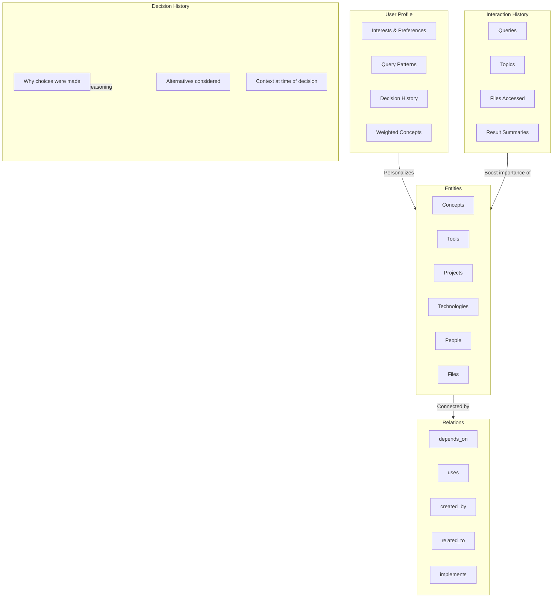
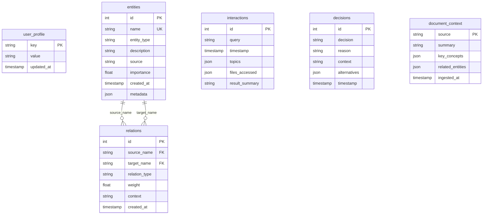
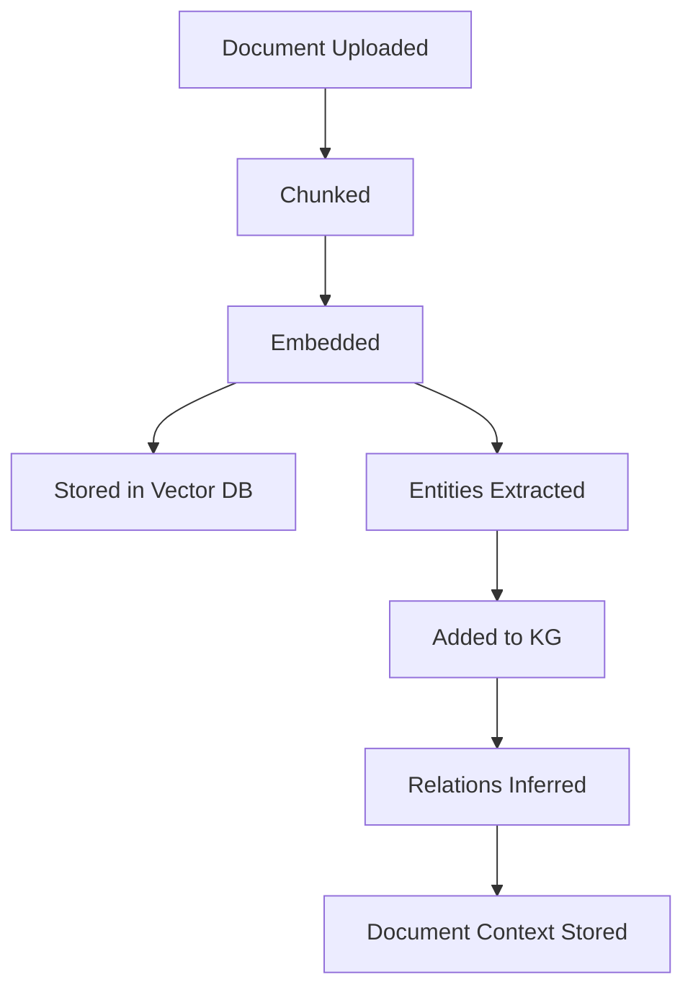
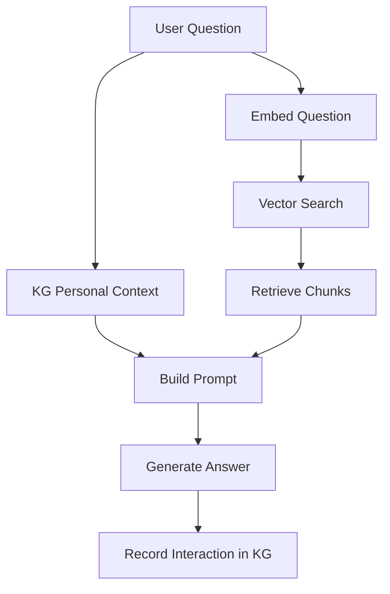

# Knowledge Graph — Personal Context Layer

## Overview

The Knowledge Graph (KG) is Aetheris's memory system. It stores everything the system learns about you — your interests, the concepts in your documents, how they connect, and your interaction history. Every query is enriched with personal context from the KG.

**Location**: `rag_core/knowledge_graph.py`  
**Storage**: SQLite (`knowledge_graph.db`)  
**Pattern**: Entity-Relation graph with user profile overlay

---

## Architecture



---

## Data Model

### Schema



### Entity Types

| Type | Example | Auto-Extracted? |
|------|---------|----------------|
| `concept` | "Zero-trust security", "CAP theorem" | Yes (from documents) |
| `tool` | "OPA", "WireGuard", "Docker" | Yes |
| `project` | "Aetheris v2.0", "RAG Pipeline" | Yes |
| `technology` | "Rust", "ZFS", "AES-256-GCM" | Yes |
| `person` | Developer names, authors | Yes |
| `file` | `compose.yaml`, `main.rs` | Yes |
| `service` | "Cloudflare Tunnel", "VictoriaMetrics" | Yes |
| `configuration` | "chunk_size=512", "port=8080" | Yes |
| `event` | "Deployment on 2026-05-03" | Yes |

### Relation Types

| Type | Direction | Example |
|------|-----------|---------|
| `depends_on` | A → B | "Aetheris depends_on OPA" |
| `uses` | A → B | "RAG uses ChromaDB" |
| `created_by` | A → B | "compose.yaml created_by user" |
| `related_to` | A ↔ B | "WireGuard related_to VPN" |
| `implements` | A → B | "Rust implements zero-copy" |
| `references` | A → B | "main.rs references connector.rs" |
| `contains` | A → B | "Aetheris contains RAG" |
| `located_at` | A → B | "Service located_at port 8080" |
| `configures` | A → B | "compose.yaml configures RAG" |
| `belongs_to` | A → B | "Chunk belongs_to document" |

---

## Core Operations

### User Profile

```python
kg = KnowledgeGraph()

# Set profile values
kg.set_profile("role", "software engineer")
kg.set_profile("interests", "networking, security, distributed systems")
kg.set_profile("preferred_language", "Rust")

# Get profile
role = kg.get_profile("role")  # "software engineer"
full = kg.get_full_profile()   # {"role": "...", "interests": "...", ...}
```

### Entities

```python
# Add entity
kg.add_entity(
    name="WireGuard",
    entity_type="technology",
    description="Modern VPN protocol using UDP 51820",
    source="docs/wireguard.txt",
    importance=8.5,
    metadata={"port": 51820, "protocol": "UDP"}
)

# Get entity
wg = kg.get_entity("WireGuard")
# {"name": "WireGuard", "type": "technology", "description": "...", "importance": 8.5, ...}

# List entities
all_tech = kg.list_entities(entity_type="technology", min_importance=5.0, limit=50)

# Delete entity
kg.delete_entity("WireGuard")  # Also deletes relations
```

### Relations

```python
# Create relation
kg.add_relation(
    source="Aetheris",
    target="WireGuard",
    relation_type="uses",
    weight=1.0,
    context="Used for mesh networking between nodes"
)

# Get all relations for an entity
rels = kg.get_relations("Aetheris")
# [{"source": "Aetheris", "target": "WireGuard", "type": "uses", "weight": 1.0, ...}]

# Get connections (multi-hop)
connections = kg.get_connections("Aetheris", depth=2)
# Returns all entities connected within 2 hops
```

### Interactions

```python
# Record a query
kg.record_interaction(
    query="How do I configure WireGuard?",
    topics=["wireguard", "vpn", "configuration"],
    files_accessed=["docs/wireguard.txt"],
    result_summary="Configure wg0.conf with private key and peer settings"
)

# Get recent interactions
recent = kg.get_recent_interactions(limit=10)

# Analyze query patterns
patterns = kg.get_query_patterns()
# {"total_queries": 156, "top_topics": [("wireguard", 12), ("opa", 8), ...]}
```

### Decisions

```python
# Record a decision
kg.record_decision(
    decision="Use OPA for policy enforcement",
    reason="Fine-grained access control with Rego language",
    context="Compared with CASBIN and custom RBAC",
    alternatives=["CASBIN", "Custom RBAC", "OPA"]
)

# Get decisions
decisions = kg.get_decisions(limit=10)
```

### Document Context

```python
# Store document summary
kg.set_document_context(
    source="docs/wireguard.txt",
    summary="WireGuard configuration guide for Aetheris mesh network",
    key_concepts=["VPN", "UDP", "mesh networking", "encryption"],
    related_entities=["WireGuard", "Aetheris", "AES-256-GCM"]
)

# Get document context
ctx = kg.get_document_context("docs/wireguard.txt")
```

---

## Personal Context for RAG

The most powerful feature: automatically building personal context for each query.

```python
# Before sending a query to the LLM, enrich with KG context
context = kg.get_personal_context("How do I set up WireGuard?")
```

**Returns**:
```
## User Profile
- role: software engineer
- interests: networking, security, distributed systems

## Relevant Concepts
- WireGuard (technology, importance: 8.5)
- VPN (concept, importance: 7.2)
- mesh networking (concept, importance: 6.8)

## Your Recent Related Questions
- Q: What port does WireGuard use?
- Q: How do I configure a VPN tunnel?

## Recent Decisions
- Use OPA for policy enforcement: Fine-grained access control with Rego language
```

This context is injected into the LLM prompt, making responses feel personalized.

---

## Import / Export

### Export

```python
data = kg.export_graph()
# {
#   "exported_at": "2026-05-03T14:32:15",
#   "user_profile": {...},
#   "entities": [...],
#   "relations": [...],
#   "decisions": [...],
#   "document_context": {...},
#   "interactions": [...]
# }

# Save to file
import json
with open("kg_backup.json", "w") as f:
    json.dump(data, f, indent=2)
```

### Import

```python
# Load from file
with open("kg_backup.json", "r") as f:
    data = json.load(f)

# Import (merge with existing)
kg.import_graph(data, merge=True)

# Import (replace existing)
kg.import_graph(data, merge=False)
```

---

## Statistics

```python
stats = kg.stats()
# {
#   "entities": 245,
#   "relations": 180,
#   "interactions": 156,
#   "decisions": 23,
#   "documents_with_context": 8,
#   "entity_types": {
#     "technology": 45,
#     "concept": 89,
#     "tool": 34,
#     "project": 12,
#     "file": 45,
#     "person": 8,
#     "service": 12
#   },
#   "db_path": "/app/rag_data/knowledge_graph.db",
#   "db_size_mb": 2.4
# }
```

---

## Reset Options

```python
# Full reset (everything)
kg.reset()

# Keep entities and interactions, clear decisions and document context
kg.reset(keep_entities=True, keep_interactions=True)

# Keep only entities
kg.reset(keep_entities=True, keep_interactions=False)
```

---

## Integration with RAG Pipeline

### On Ingest



### On Query



---

## Performance

| Operation | Latency | Notes |
|-----------|---------|-------|
| `add_entity` | < 1ms | Single INSERT |
| `get_entity` | < 1ms | Indexed lookup |
| `get_connections` | < 10ms | BFS traversal, depth 2 |
| `get_personal_context` | < 20ms | Multiple queries, string building |
| `export_graph` | < 100ms | Full graph serialization |
| `import_graph` | < 200ms | Bulk insert with merge |

**Database Size**: ~2-5 MB for 1000 entities, 500 relations, 200 interactions.

---

## Security

- **SQLite WAL mode**: Safe concurrent access
- **No external network calls**: All data stays local
- **No PII stored by default**: Only what you explicitly add
- **Export contains all data**: Be careful with backup files

---

## Best Practices

### Entity Naming

Use consistent, unique names:
- ✅ `WireGuard` (not `wireguard`, `Wireguard`, `wg`)
- ✅ `Open Policy Agent` (not `opa`, `OPA` — use acronym consistently)

### Importance Scores

| Score | Meaning |
|-------|---------|
| 1.0 | Default, neutral |
| 5.0+ | Important concept |
| 8.0+ | Core to your work |
| 10.0 | Critical, always relevant |

Importance increases automatically when entities are mentioned in queries.

### Relation Weights

| Weight | Meaning |
|--------|---------|
| 0.1-0.3 | Weak connection |
| 0.4-0.6 | Moderate connection |
| 0.7-1.0 | Strong connection |

---

## Troubleshooting

### Entity not found

```python
# Check if entity exists
entity = kg.get_entity("WireGuard")
if entity is None:
    print("Entity doesn't exist. Check spelling or add it.")
```

### Duplicate entities

The KG uses `UNIQUE` constraint on entity names. If you try to add a duplicate, it's silently ignored. To update:

```python
kg.delete_entity("WireGuard")
kg.add_entity("WireGuard", "technology", description="Updated description")
```

### Large database

```python
stats = kg.stats()
if stats["db_size_mb"] > 100:
    # Export and re-import without old interactions
    data = kg.export_graph()
    data["interactions"] = data["interactions"][-100:]  # Keep last 100
    kg.reset()
    kg.import_graph(data, merge=False)
```
