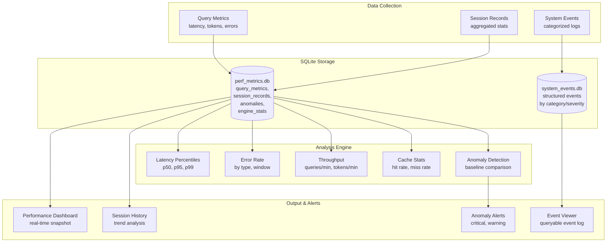
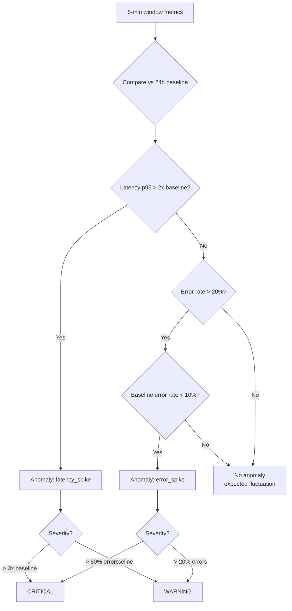
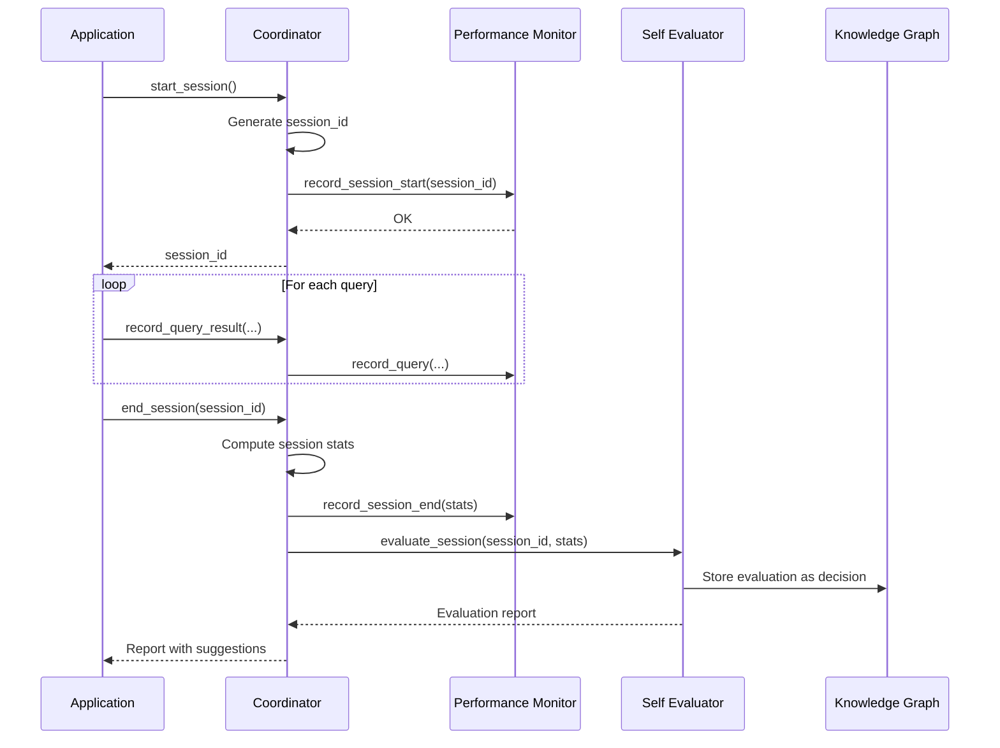

# App Performance Monitor & Observability

## Overview

The App Performance Monitor is Aetheris's internal observability layer — equivalent to Windows Performance Monitor, Linux `perf`, Android systrace, or iOS Instruments. It tracks application-level metrics, detects anomalies, and provides actionable insights for continuous improvement.

**Location**: `rag_core/coordinator.py` → `AppPerformanceMonitor`, `SystemEventLogger`, `SelfEvaluator`  
**Storage**: SQLite databases in `/workspace/persisted/`  
**Runtime Overhead**: < 1ms per metric record (single INSERT with WAL mode)

---

## Architecture



---

## Metrics Collected

### Query Metrics (High-Volume)

Every query generates a `query_metrics` record:

```python
perf_monitor.record_query(
    engine="rag",
    latency_ms=245.3,
    tokens_in=1200,
    tokens_out=800,
    cache_hit=False,
    queue_wait_ms=12.5,
    success=True,
    error_type=None,
)
```

| Field | Type | Description |
|-------|------|-------------|
| `timestamp` | ISO 8601 | When the query completed |
| `engine` | string | Which engine processed it (rag, ai, dev) |
| `latency_ms` | float | Total processing time in milliseconds |
| `tokens_in` | int | Input tokens (prompt + context) |
| `tokens_out` | int | Output tokens (generated response) |
| `cache_hit` | bool | Whether result was served from cache |
| `queue_wait_ms` | float | Time spent waiting in queue |
| `success` | bool | Did the query succeed? |
| `error_type` | string | Type of error if failed (transient/permanent/resource) |

### Session Records (Aggregated)

Each session produces one summary record when `end_session()` is called:

| Field | Description |
|-------|-------------|
| `session_id` | Unique identifier |
| `started_at` / `ended_at` | Session boundaries |
| `total_queries` | Queries processed |
| `successful_queries` / `failed_queries` | Outcome breakdown |
| `total_tokens_in` / `total_tokens_out` | Token consumption |
| `avg_latency_ms` | Average response time |
| `p95_latency_ms` / `p99_latency_ms` | Tail latency |
| `cache_hit_rate` | 0.0 - 1.0 |
| `circuit_trips` | How many times circuits opened |
| `resource_events` | RAM/disk threshold triggers |
| `kg_entities_added` / `kg_relations_added` | Knowledge growth |

### System Events (Structured Logs)

Categorized, severity-tagged event log — your app's equivalent of Windows Event Viewer:

```python
event_logger.log(
    category=SystemEventLogger.Category.ENGINE,
    severity=SystemEventLogger.Severity.WARNING,
    event_type="health_check_failed",
    message="LMStudio health check failed: connection refused",
    source="rag_engine",
    context={"endpoint": "http://localhost:1234", "attempts": 3},
    session_id="session_20260503_143215_abc12345",
)
```

**Event Categories**:

| Category | Examples |
|----------|----------|
| `lifecycle` | Startup, shutdown, config reload, KG attached |
| `engine` | Engine up/down, model loaded, health check pass/fail |
| `user` | Session start/end, query, upload, settings change |
| `system` | Resource event, circuit trip, cleanup run, anomaly |
| `security` | Auth failure, policy violation, suspicious activity |
| `evaluation` | Self-evaluation completed, suggestion generated |

**Severity Levels**:

| Level | When to Use | Color |
|-------|------------|-------|
| `INFO` | Normal operations, status updates | 🔵 Blue |
| `WARNING` | Degraded performance, approaching thresholds | 🟡 Yellow |
| `ERROR` | Failed operations, circuit trips | 🔴 Red |
| `CRITICAL` | System-wide failures, data loss risk | 🔴🔴 Critical Red |

---

## Performance Dashboard

Real-time snapshot of all metrics:

```python
dashboard = coordinator.get_performance_dashboard()
```

**Returns**:

```json
{
  "latency": {
    "5min": {"count": 12, "p50": 245.0, "p95": 890.0, "p99": 1200.0, "min": 120.0, "max": 1450.0, "avg": 380.5},
    "1hour": {"count": 145, "p50": 220.0, "p95": 650.0, "p99": 980.0, "min": 80.0, "max": 2100.0, "avg": 310.2},
    "24hour": {"count": 2340, "p50": 210.0, "p95": 580.0, "p99": 850.0, "min": 45.0, "max": 5200.0, "avg": 285.7}
  },
  "errors": {
    "5min": {"total": 12, "failures": 1, "error_rate": 0.083, "by_type": {"transient": 1}},
    "1hour": {"total": 145, "failures": 8, "error_rate": 0.055, "by_type": {"transient": 5, "permanent": 3}}
  },
  "throughput": {
    "window_minutes": 5,
    "queries_per_minute": 2.4,
    "tokens_per_minute": 4800.0,
    "by_engine": [{"engine": "rag", "queries": 12, "tokens": 24000}]
  },
  "cache": {
    "total_queries": 145,
    "cache_hits": 23,
    "cache_misses": 122,
    "hit_rate": 0.159
  },
  "anomalies": [
    {"metric": "latency_p95", "value": 890.0, "baseline": 580.0, "severity": "warning", "deviation": 0.534}
  ]
}
```

---

## Anomaly Detection

Automatic detection by comparing recent windows against historical baselines:



**Detection Rules**:

| Metric | Condition | Severity |
|--------|-----------|----------|
| Latency p95 | > 2x 24h baseline | WARNING |
| Latency p95 | > 3x 24h baseline | CRITICAL |
| Error rate | > 20% (baseline < 10%) | WARNING |
| Error rate | > 50% (baseline < 10%) | CRITICAL |

**Anomaly Record**:

```python
{
  "timestamp": "2026-05-03T14:32:15",
  "metric": "latency_p95",
  "value": 1200.0,
  "baseline": 580.0,
  "deviation": 1.069,  # 107% above baseline
  "severity": "critical",
  "details": {"window": "5min", "baseline_window": "24h"}
}
```

---

## Session Management

### Session Lifecycle



### Starting a Session

```python
# Auto-generated session ID
session_id = coordinator.start_session()
# Returns: "session_20260503_143215_abc12345"

# Or provide your own
session_id = coordinator.start_session("my_custom_session")
```

### Recording Query Results

```python
# After each query, record the result
coordinator.record_query_result(
    query="What is WireGuard?",
    success=True,
    confidence=0.85,
    iterations=2,
    latency_ms=245.3,
    tokens_in=1200,
    tokens_out=800,
    cache_hit=False,
)

# On failure
coordinator.record_query_result(
    query="What is ZFS?",
    success=False,
    confidence=0.0,
    iterations=0,
    latency_ms=5000.0,
    error="Connection refused: LMStudio not responding",
)
```

### Ending a Session

```python
report = coordinator.end_session()
```

Returns an evaluation report (see Self-Evaluator docs):

```json
{
  "session_id": "session_20260503_143215_abc12345",
  "evaluated_at": "2026-05-03T14:45:00",
  "scores": {
    "answer_quality": {"score": 7.5, "convergence_rate": 0.80, "avg_confidence": 0.82, "avg_iterations": 2.1},
    "efficiency": {"score": 6.0, "tokens_per_query": 2000, "total_tokens": 40000},
    "knowledge_growth": {"score": 8.0, "entity_growth": 15, "relation_growth": 8}
  },
  "trends": {
    "confidence": {"direction": "improving", "delta": 0.08, "first_half_avg": 0.74, "second_half_avg": 0.82}
  },
  "suggestions": [
    {
      "priority": "medium",
      "category": "efficiency",
      "suggestion": "Reduce top_k from default or tighten chunk_size",
      "reason": "2000 tokens/query (target: <2000)",
      "expected_impact": "30-50% reduction in token consumption"
    }
  ],
  "anomalies": []
}
```

---

## Event Log Queries

Query the system event log like an OS event viewer:

```python
# All events in last hour
events = coordinator.get_event_log(since_minutes=60)

# Only errors
errors = coordinator.get_event_log(severity="error")

# Only engine events
engine_events = coordinator.get_event_log(category="engine")

# Events for a specific session
session_events = coordinator.get_event_log(session_id="session_abc123")

# Event counts for last 24 hours
counts = coordinator.get_event_counts(hours=24)
# Returns: {"total": 156, "by_category": {"lifecycle": 3, "engine": 12, ...}, "by_severity": {"info": 140, "warning": 14, "error": 2}}
```

---

## Performance Data Retention

| Data Type | Retention | Pruning |
|-----------|-----------|---------|
| `query_metrics` | 7 days (default) | `perf_monitor.prune_old_data(days=7)` |
| `session_records` | Permanent | None (lightweight) |
| `anomalies` | Permanent | None (lightweight) |
| `system_events` | Permanent | None (lightweight) |
| Audit logs (JSONL) | 1 file/month | Manual cleanup |

**Recommended pruning schedule**:

```python
# Run daily (add to cleanup scheduler or cron)
deleted = perf_monitor.prune_old_data(days=7)
if deleted > 0:
    logger.info(f"Pruned {deleted} old query metrics records")
```

---

## Comparison with OS Monitoring Tools

| Feature | Windows PerfMon | Linux perf | Android systrace | iOS Instruments | Aetheris Perf Monitor |
|---------|----------------|------------|-----------------|----------------|---------------------|
| **Real-time metrics** | Yes | Yes | Yes | Yes | Yes |
| **Latency percentiles** | No | Yes | Yes | Yes | Yes |
| **Error tracking** | Limited | No | No | No | Yes (by type) |
| **Session tracking** | No | No | No | No | Yes |
| **Anomaly detection** | No | No | No | No | Yes (auto) |
| **Self-evaluation** | No | No | No | No | Yes |
| **Persistent storage** | Windows Event Log | Files | Trace files | Trace files | SQLite |
| **Query interface** | GUI only | CLI | CLI/Viewer | GUI | Python API |

---

## Integration with External Monitoring

### VictoriaMetrics (Host Metrics)

The coordinator can query VictoriaMetrics for host-level metrics when psutil is unavailable:

```python
# VictoriaMetrics PromQL queries used internally:
# RAM: node_memory_MemAvailable_bytes / 1024 / 1024
# Disk: node_filesystem_avail_bytes{mountpoint="/"} / 1024 / 1024 / 1024
# Load: node_load1
```

**Configuration**:

```python
config = CoordinatorConfig(
    metrics_endpoint="http://localhost:8428",  # VictoriaMetrics
    metrics_enabled=True,
)
```

### Prometheus Export (Future)

The performance monitor can be extended to expose a `/metrics` endpoint for Prometheus scraping:

```python
# Future: coordinator.start_metrics_server(port=9090)
# Exposes:
#   aetheris_query_latency_ms (histogram)
#   aetheris_error_rate (gauge)
#   aetheris_queries_total (counter)
#   aetheris_cache_hit_rate (gauge)
```

---

## Troubleshooting

### High Latency

```python
dashboard = coordinator.get_performance_dashboard()
print(f"p95 latency: {dashboard['latency']['5min']['p95']}ms")

# Check by engine
lat = coordinator.perf_monitor.get_latency_percentiles(engine="rag", window_minutes=60)
```

**Common causes**:
- LMStudio model loading (first query after idle)
- Large context (many chunks retrieved)
- Queue wait (other queries in flight)

### High Error Rate

```python
errors = coordinator.perf_monitor.get_error_rate(window_minutes=60)
print(f"Error rate: {errors['error_rate']}")
print(f"By type: {errors['by_type']}")
```

**Actions by error type**:
- `transient`: Check engine connectivity, consider increasing timeout
- `permanent`: Check authentication, model availability
- `resource`: Check RAM/disk usage, may need to reduce concurrent jobs

### Session Comparison

```python
sessions = coordinator.get_session_history(limit=10)
for s in sessions:
    print(f"{s['session_id']}: {s['total_queries']} queries, "
          f"avg {s['avg_latency_ms']}ms, "
          f"{s['cache_hit_rate']*100:.0f}% cache hit")
```
