# RAG Pipeline — Complete Workflow

## Overview

The Aetheris RAG (Retrieval-Augmented Generation) pipeline transforms raw documents into indexed knowledge and uses that knowledge to answer questions with citations. This document details every step from upload to answer.

**Location**: `rag_core/pipeline.py`, `rag_cli.py`  
**Components**: Chunker → Embedder → Vector Store → Retriever → Generator

---

## High-Level Architecture

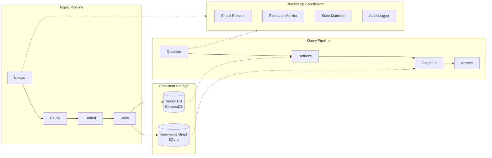

---

## Directory Architecture

Strict separation prevents all collision/overwrite scenarios:

```mermaid
graph TD
    subgraph Workspace["/workspace/"]
        subgraph Input["input/ — Raw uploads\nTTL: 1 hour"]
            I1["{uuid}/filename.txt\nUUID-isolated staging"]
        end
        
        subgraph Preprocess["preprocess/ — Cleaned, validated\nTTL: 24 hours"]
            P1["{uuid}/chunks/\nJSON chunk files"]
            P2["{uuid}/metadata.json"]
        end
        
        subgraph Processing["processing/ — Active computation\nTTL: 1 hour"]
            PR1["{uuid}/embeddings.npy\nRAM→disk spillover"]
            PR2["{uuid}/state.json\nPregel checkpoint"]
        end
        
        subgraph Intermediate["intermediate/ — Cross-engine\nTTL: 6 hours"]
            IM1["{conv_id}/rag_to_ai.json"]
            IM2["{conv_id}/ai_to_dev.json"]
        end
        
        subgraph Output["output/ — Final results\nTTL: 7 days"]
            O1["{uuid}/answer.json"]
            O2["{uuid}/sources.json"]
        end
        
        subgraph Persisted["persisted/ — Permanent"]
            PE1["kg.db — Knowledge Graph"]
            PE2["vectors.db — Vector DB"]
            PE3["storage/{year}/{month}/\nPermanent copies"]
            PE4["audit/{year}-{month}.jsonl"]
        end
    end
    
    Input -->|"TTL: 1h"| Preprocess
    Preprocess -->|"TTL: 24h"| Processing
    Processing -->|"TTL: 1h"| Intermediate
    Intermediate -->|"TTL: 6h"| Output
    Output -->|"TTL: 7d"| Persisted
```

**TTL Rules**:

| Directory | TTL | Rationale | Auto-Cleanup |
|-----------|-----|-----------|-------------|
| `input/` | 1 hour | Raw uploads should be processed quickly | Yes |
| `preprocess/` | 24 hours | May be needed for re-processing | Yes |
| `processing/` | 1 hour | Active computation should complete fast | Yes |
| `intermediate/` | 6 hours | Cross-engine data may need time | Yes |
| `output/` | 7 days | Final results kept for review | Yes |
| `.tmp/` | 30 minutes | Temporary files | Yes |
| `persisted/` | Never | Long-term storage | No |

---

## Ingest Workflow — Step by Step

### Step 1: Upload

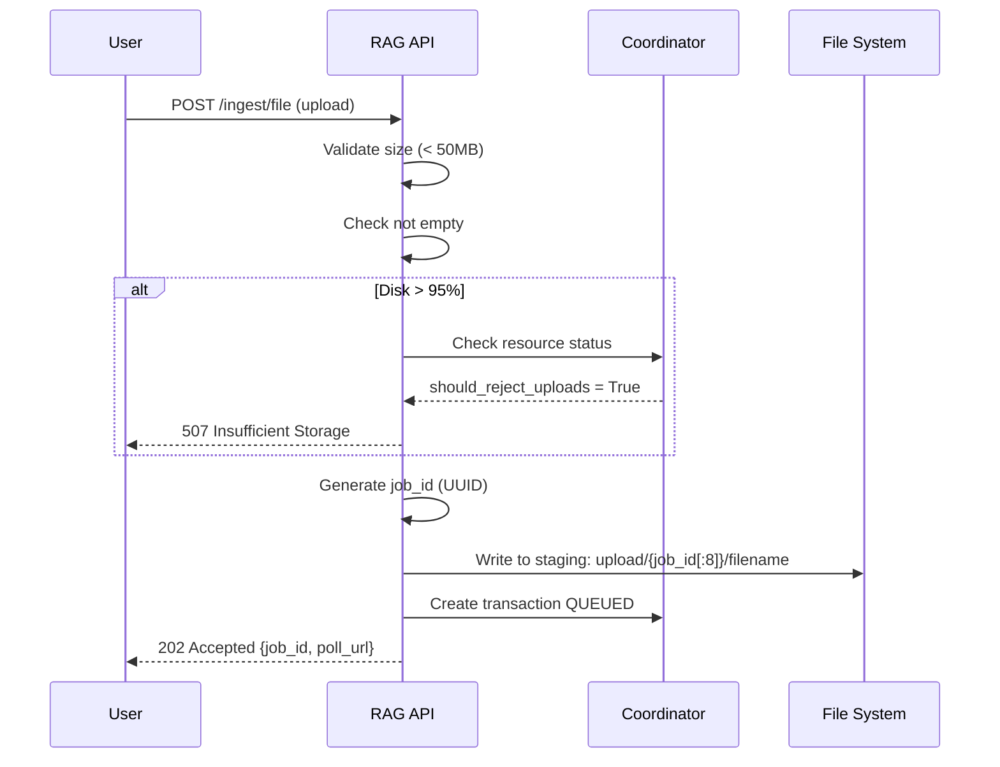

**File Size Limits**:

| Config | Default | Max |
|--------|---------|-----|
| `max_upload_size` | 50 MB | Environment variable |

**Supported Extensions**:
`.txt`, `.md`, `.py`, `.rs`, `.js`, `.ts`, `.html`, `.css`, `.json`, `.yaml`, `.yml`, `.toml`, `.cfg`, `.ini`

### Step 2: Chunking

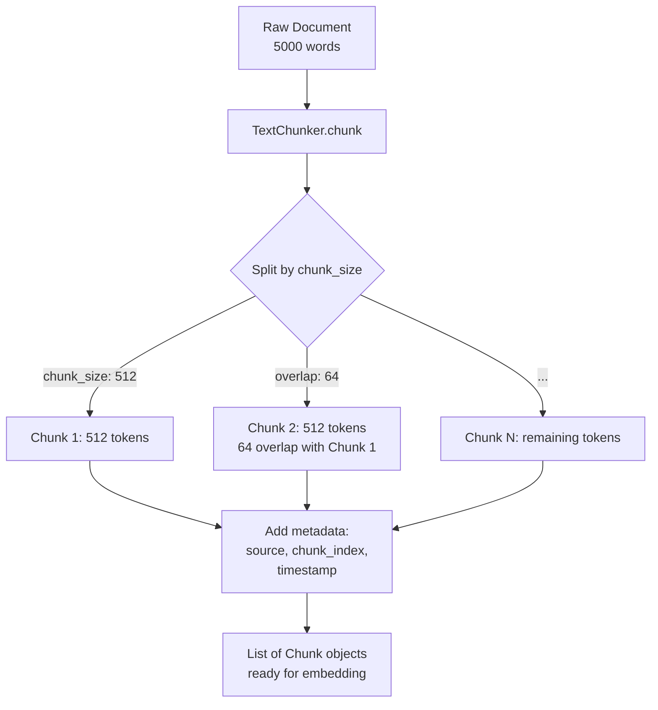

**Chunking Parameters**:

| Parameter | Default | Effect |
|-----------|---------|--------|
| `chunk_size` | 512 tokens | Larger chunks = more context per retrieval, but noisier |
| `chunk_overlap` | 64 tokens | Overlap prevents context loss at chunk boundaries |

**Chunk Object**:

```python
@dataclass
class Chunk:
    text: str              # The chunk text
    source: str            # Original file path
    chunk_index: int       # Position in document (0, 1, 2, ...)
    metadata: dict         # Custom metadata
    embedding: List[float] # Populated during embedding step
```

### Step 3: Embedding

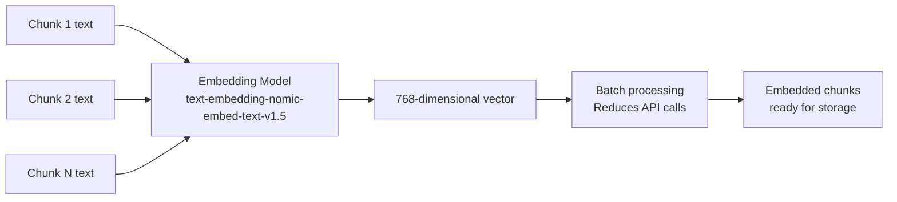

**Embedding Configuration**:

| Parameter | Value | Notes |
|-----------|-------|-------|
| Model | `text-embedding-nomic-embed-text-v1.5` | Nomic's embedding model |
| Dimensions | 768 | Fixed vector size |
| Batch size | Auto | Batches chunks for efficiency |
| Endpoint | `http://localhost:1234` | LMStudio or remote |

### Step 4: Storage

```mermaid
graph TD
    A[Embedded Chunks] --> B[VectorStore.add]
    B --> C{Store in SQLite}
    C --> D[Vectors table\n(chunk_id, vector blob, metadata)]
    C --> E[Chunks table\n(chunk_id, text, source, metadata)]
    
    D --> F[HNSW index\nfor fast similarity search]
    E --> G[Full-text search\nfor keyword matching]
    
    B --> H{Store in Knowledge Graph}
    H --> I[Entities table\nextracted concepts]
    H --> J[Relations table\nconnections between entities]
    H --> K[Document context table\nsource summaries]
```

**Storage Schema**:

```sql
-- Vector store
CREATE TABLE chunks (
    id INTEGER PRIMARY KEY,
    source TEXT,
    chunk_index INTEGER,
    text TEXT,
    metadata TEXT,
    tokens INTEGER
);

CREATE TABLE vectors (
    id INTEGER PRIMARY KEY REFERENCES chunks(id),
    embedding BLOB  -- Packed float array
);
```

---

## Query Workflow — Step by Step

### Step 1: Receive Query

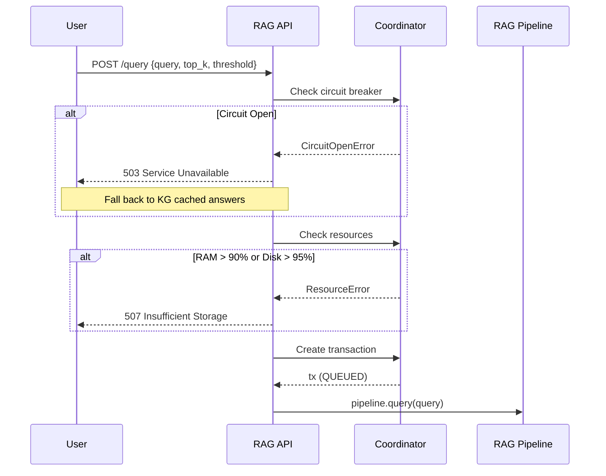

### Step 2: Retrieve

```mermaid
graph TD
    A[User Question\n"What is WireGuard?"] --> B[Embed Question\nsame model as chunks]
    B --> C[768-dim Question Vector]
    
    C --> D{Vector Similarity Search}
    D --> E[Cosine Similarity\nagainst all chunk vectors]
    E --> F[Rank by similarity score]
    
    F --> G{Apply filters}
    G -->|top_k: 5| H[Take top 5 matches]
    G -->|threshold: 0.65| I[Filter below threshold]
    
    H --> J[RRF Fusion\nif multiple retrieval methods]
    I --> J
    
    J --> K[Final Context\n5 chunks with scores]
```

**Retrieval Parameters**:

| Parameter | Default | Effect |
|-----------|---------|--------|
| `top_k` | 5 | Number of chunks to retrieve |
| `similarity_threshold` | 0.65 | Minimum cosine similarity |
| `rrf_k` | 60 | RRF (Reciprocal Rank Fusion) constant |

### Step 3: Generate

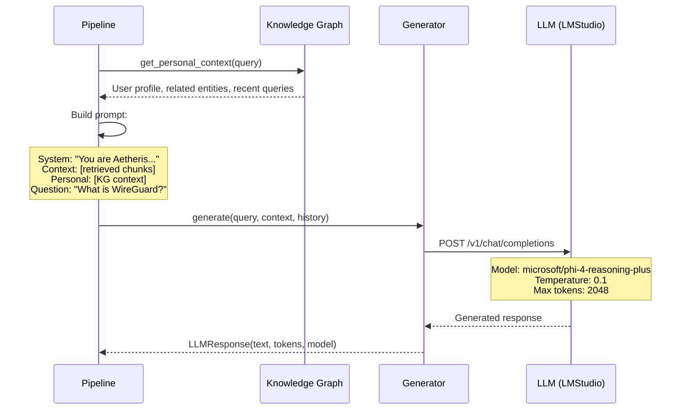

**System Prompt**:

```
You are Aetheris, a personal AI assistant. Answer questions based on the
provided context. If the context doesn't contain relevant information,
say so clearly. Never fabricate information.
```

**Generation Parameters**:

| Parameter | Default | Effect |
|-----------|---------|--------|
| `temperature` | 0.1 | Low = deterministic, high = creative |
| `max_tokens` | 2048 | Maximum response length |
| `request_timeout` | 120s | Timeout for LLM API call |

### Step 4: Return Answer

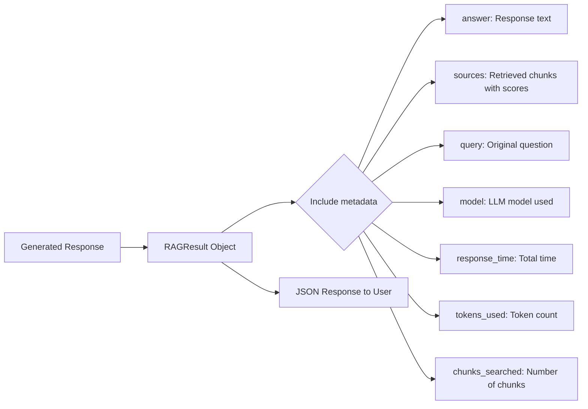

**Response Format**:

```json
{
  "answer": "WireGuard is a modern VPN protocol...",
  "sources": [
    {"source": "docs/networking.md", "score": 0.89, "chunk_index": 3},
    {"source": "docs/wireguard.txt", "score": 0.85, "chunk_index": 0}
  ],
  "query": "What is WireGuard?",
  "model": "microsoft/phi-4-reasoning-plus",
  "response_time": 2.456,
  "tokens_used": 1245,
  "chunks_searched": 5
}
```

---

## Reasoning Loop (Advanced)

For complex questions, the reasoning loop iteratively refines answers:

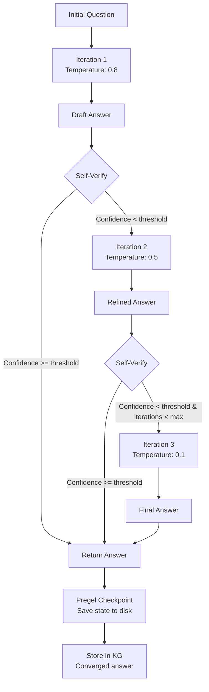

**Reasoning Parameters**:

| Parameter | Default | Range |
|-----------|---------|-------|
| `reasoning_enabled` | false | true/false |
| `max_iterations` | 3 | 1-10 |
| `confidence_threshold` | 0.7 | 0.0-1.0 |
| `temperature_schedule` | 0.8→0.5→0.1 | Annealing schedule |

**Temperature Schedule** (Hegelian Dialectic):

| Iteration | Temperature | Purpose |
|-----------|------------|---------|
| 1 | 0.8 | High creativity — explore diverse approaches |
| 2 | 0.5 | Balanced — refine promising direction |
| 3+ | 0.1 | Low creativity — converge to precise answer |

---

## Knowledge Graph Integration

### Entity Extraction on Ingest

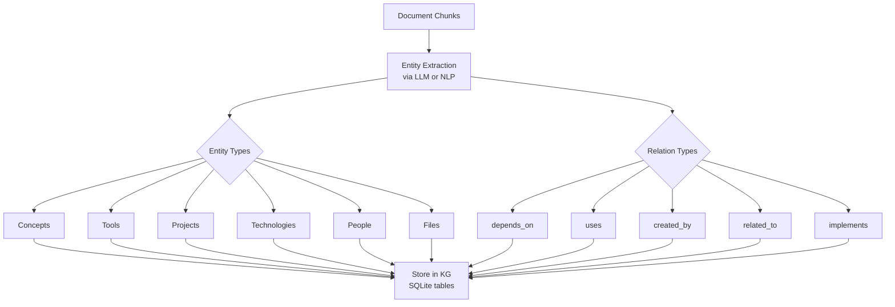

### Query Enrichment

When a query arrives, the KG provides personal context:

```python
# Before sending to LLM, enrich with KG context
personal_context = kg.get_personal_context(query)
# Returns:
# ## User Profile
# - role: software engineer
# - interests: networking, security
#
# ## Relevant Concepts
# - WireGuard (technology, importance: 8.5)
# - VPN (concept, importance: 7.2)
#
# ## Your Recent Related Questions
# - Q: How do I set up a VPN?
```

---

## Background Job Processing

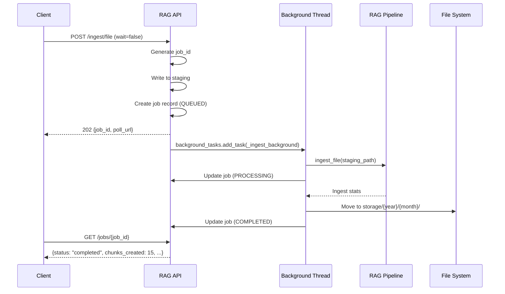

**Job States**:

| State | Meaning | Client Action |
|-------|---------|---------------|
| `queued` | Waiting to start | Poll `/jobs/{id}` |
| `processing` | Currently ingesting | Poll `/jobs/{id}` |
| `completed` | Success | Retrieve stats |
| `failed` | Error occurred | Check `error` field |

**Polling Endpoints**:

| Endpoint | Method | Purpose |
|----------|--------|---------|
| `/jobs/{job_id}` | GET | Get single job status |
| `/jobs` | GET | List recent jobs |
| `/ingest/stats` | GET | Overall ingest statistics |

---

## Error Scenarios

### Scenario 1: Engine Down

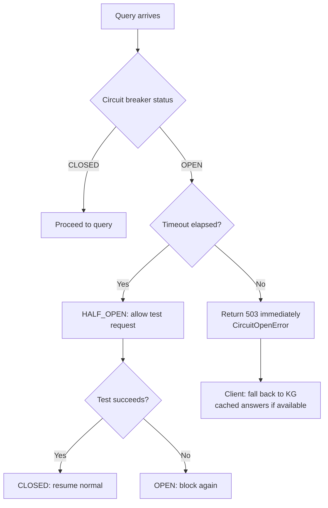

### Scenario 2: Out of Memory

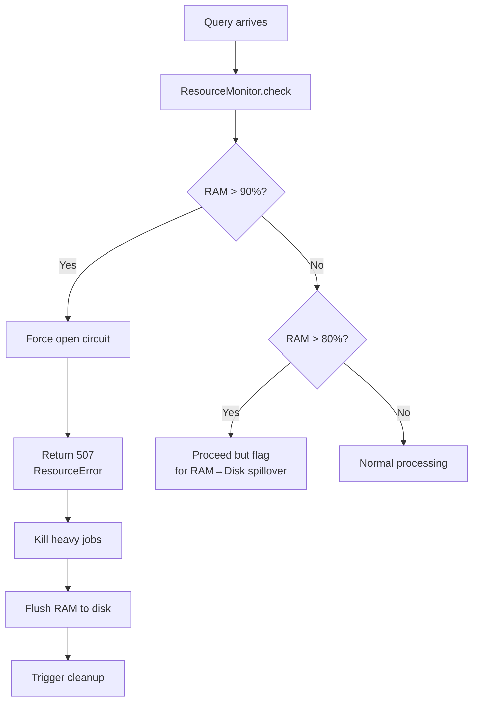

### Scenario 3: Queue Full

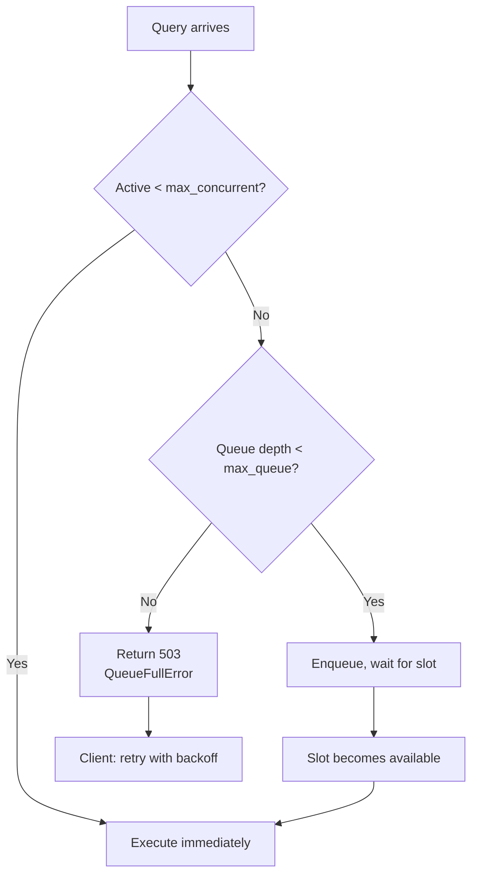

---

## Performance Characteristics

| Metric | Typical Value | Notes |
|--------|--------------|-------|
| Chunking speed | ~1000 chunks/sec | CPU-bound, fast |
| Embedding speed | ~50 chunks/sec | Depends on model and hardware |
| Retrieval latency | < 50ms | Vector similarity search |
| Generation latency | 1-5 seconds | Depends on model and response length |
| Total query latency | 1-10 seconds | Mostly generation time |
| Memory per query | ~50-200 MB | Context window + embeddings |

---

## Configuration Reference

All settings in `rag_core/config.py`:

```python
@dataclass
class RAGConfig:
    # LLM endpoint
    ai_endpoint: str = "http://localhost:1234"
    chat_model: str = "microsoft/phi-4-reasoning-plus"
    embedding_model: str = "text-embedding-nomic-embed-text-v1.5"
    
    # Chunking
    chunk_size: int = 512
    chunk_overlap: int = 64
    
    # Retrieval
    top_k: int = 5
    similarity_threshold: float = 0.65
    rrf_k: int = 60
    max_history: int = 10
    
    # Generation
    temperature: float = 0.1
    max_tokens: int = 2048
    request_timeout: int = 120
    
    # Storage
    db_path: str = "/app/rag_data/vectors.db"
    upload_dir: str = "/app/uploads"
    storage_dir: str = "/app/storage"
    max_upload_size: int = 50 * 1024 * 1024  # 50MB
    
    # Knowledge Graph
    graph_db_path: str = "/app/rag_data/knowledge_graph.db"
```

---

## API Reference

### Endpoints

| Endpoint | Method | Description | Auth |
|----------|--------|-------------|------|
| `/health` | GET | Health check | None |
| `/query` | POST | Ask a question | Cookie |
| `/ingest/file` | POST | Upload file for indexing | Cookie |
| `/ingest/directory` | POST | Index directory (server-side) | Cookie |
| `/jobs/{id}` | GET | Get job status | Cookie |
| `/jobs` | GET | List recent jobs | Cookie |
| `/ingest/stats` | GET | Ingest statistics | Cookie |
| `/stats` | GET | Pipeline statistics | Cookie |
| `/sources` | GET | List indexed sources | Cookie |
| `/sources/{path}` | DELETE | Remove a source | Cookie |
| `/reset` | POST | Clear all data | Cookie |

### Query Parameters

**POST /query**:

```json
{
  "query": "What is WireGuard?",
  "use_rag": true,
  "top_k": 3,
  "threshold": 0.7,
  "include_history": true
}
```

**POST /ingest/file**:

| Parameter | Type | Default | Description |
|-----------|------|---------|-------------|
| `file` | file | required | File to upload |
| `source` | string | filename | Source name for tracking |
| `verbose` | bool | false | Enable verbose logging |
| `wait` | bool | false | Block until complete |

---

## CLI Usage

```bash
# Index files
python rag_cli.py ingest docs/
python rag_cli.py ingest docs/guide.md

# Ask questions
python rag_cli.py query "How do I configure WireGuard?"
python rag_cli.py query "What's the weather?" --no-rag

# View stats
python rag_cli.py stats
python rag_cli.py sources

# Delete sources
python rag_cli.py delete docs/manual.pdf

# Reset
python rag_cli.py reset --force

# Start server
python rag_cli.py server --host 0.0.0.0 --port 8080
```
