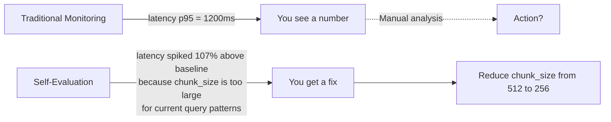
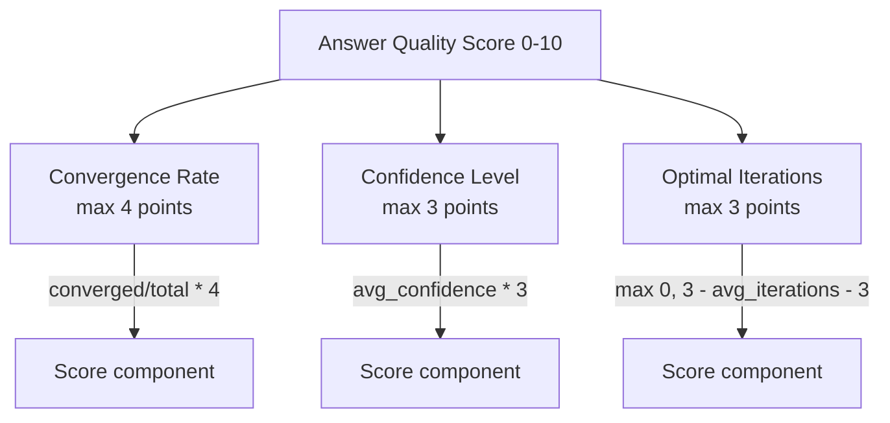
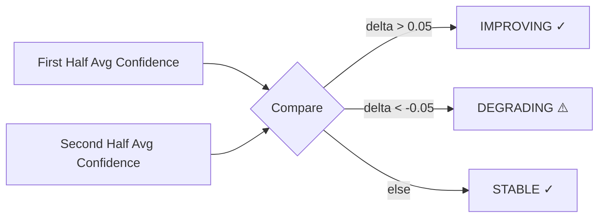
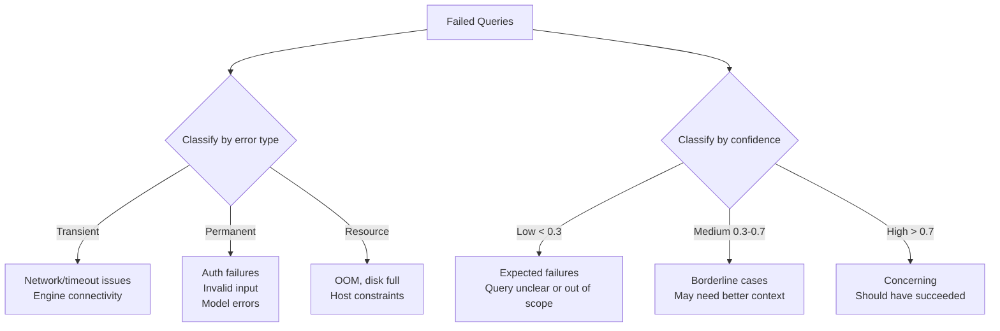
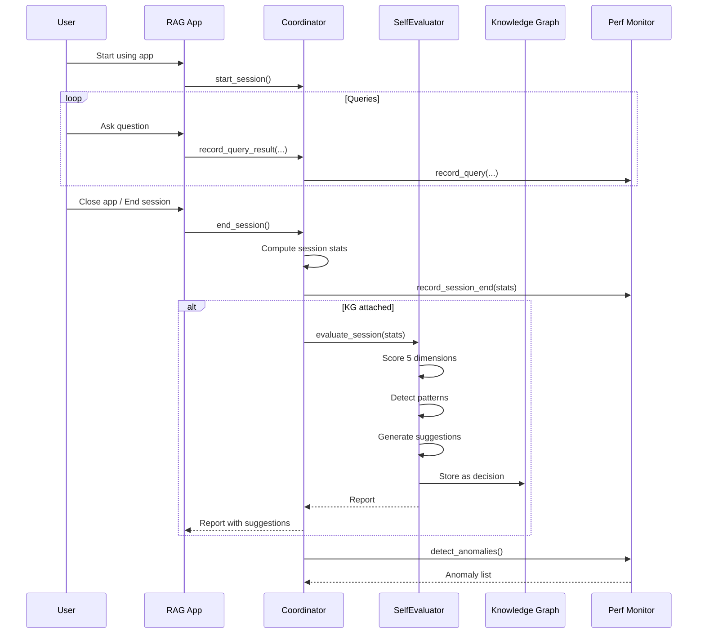
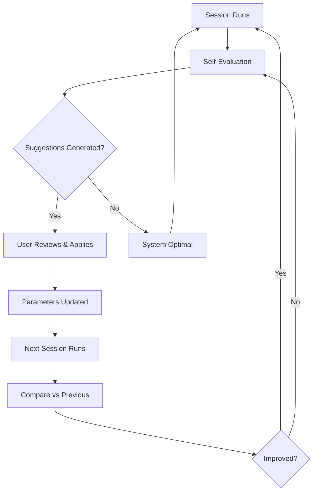

# Self-Evaluator — Continuous Improvement System

## Overview

The Self-Evaluator is Aetheris's built-in intelligence layer that analyzes session performance using the Knowledge Graph to identify improvement opportunities. It runs post-session (zero runtime cost) and produces actionable suggestions for parameter tuning, pattern detection, and degradation alerts.

**Location**: `rag_core/coordinator.py` → `SelfEvaluator`  
**Trigger**: Called automatically on `end_session()` when KG is attached  
**Output**: Evaluation report with scores, trends, and prioritized suggestions

---

## Why Self-Evaluation Matters

Traditional monitoring tells you **what** is happening. Self-evaluation tells you **why** and **what to do about it**.



---

## Evaluation Dimensions

The evaluator scores five dimensions of system performance:

### 1. Answer Quality (Weight: 40%)

**What it measures**: How well answers converge to high-confidence results.



**Scoring Formula**:

```python
score = min(4, convergence_rate * 4)    # 40% weight
      + min(3, avg_confidence * 3)      # 30% weight
      + min(3, max(0, 3 - |avg_iterations - 3|))  # 30% weight
```

**Interpretation**:

| Score | Meaning | Action |
|-------|---------|--------|
| 8-10 | Excellent convergence | Maintain current settings |
| 6-7 | Good, room for improvement | Review confidence threshold |
| 4-5 | Moderate quality | Consider increasing max iterations |
| 0-3 | Poor convergence | Investigate retrieval quality, model health |

### 2. Confidence Trend

**What it measures**: Is the system getting more or less confident over the session?



**Why it matters**: Degrading confidence mid-session often indicates:
- Retrieval quality declining (running out of relevant chunks)
- Model fatigue (context window filling with irrelevant data)
- Topic shift requiring different retrieval strategy

### 3. Efficiency (Weight: 25%)

**What it measures**: Token consumption vs. benchmark.

```python
# Benchmark: ~2000 tokens/query is reasonable for RAG
efficiency_score = max(0, min(10, 10 - (tokens_per_query - 2000) / 500))
```

| Tokens/Query | Score | Assessment |
|--------------|-------|------------|
| < 1500 | 10.0 | Very efficient |
| 2000 | 8.0 | Good |
| 3000 | 6.0 | Acceptable |
| 4000 | 4.0 | Inefficient |
| > 5000 | 2.0 | Very inefficient |

### 4. Knowledge Growth (Weight: 20%)

**What it measures**: How much new knowledge was added to the KG.

```python
growth_score = min(10, (entity_growth + relation_growth) / 2)
```

**Why it matters**: A system that learns from each session becomes more personalized and effective over time.

### 5. Reliability (Weight: 15%)

**What it measures**: Failure rate and error patterns.

```python
reliability_score = max(0, 10 * (1 - failure_rate))
```

---

## Failure Pattern Analysis

The evaluator categorizes failures to identify systemic issues:



**Output**:

```python
{
  "count": 3,
  "by_error_type": {"transient": 2, "permanent": 1},
  "by_confidence_range": {"low": 1, "medium": 1, "high": 1},
  "failure_rate": 0.15  # 15% of queries failed
}
```

---

## Auto-Suggestions

The evaluator generates prioritized, actionable suggestions:

### Suggestion Priority Levels

| Priority | When Generated | User Impact |
|----------|---------------|-------------|
| **High** | Convergence < 50%, confidence degrading, failure rate > 10% | Immediate action recommended |
| **Medium** | Token usage > 4000/query, minor efficiency issues | Schedule for next maintenance window |
| **Low** | Low knowledge growth, minor optimizations | Nice to have, no urgency |

### Suggestion Categories

| Category | Example Suggestions |
|----------|-------------------|
| `reasoning` | "Increase max iterations from 3 to 5-7" |
| `model` | "Review retrieval quality — degraded confidence suggests poor context" |
| `efficiency` | "Reduce top_k from default or tighten chunk_size" |
| `reliability` | "Investigate transient errors — engine may need restart" |
| `knowledge` | "Enable entity extraction on ingest to grow KG faster" |

### Suggestion Format

```python
{
  "priority": "high",
  "category": "reasoning",
  "suggestion": "Increase max iterations from 3 to 5-7",
  "reason": "Only 40% of answers converged",
  "expected_impact": "10-20% improvement in answer quality"
}
```

---

## Overall Score Computation

Weighted combination of all dimensions:

```python
overall_score = (
    answer_quality_score * 0.40 +    # 40% weight
    efficiency_score * 0.25 +        # 25% weight
    knowledge_growth_score * 0.20 +  # 20% weight
    reliability_score * 0.15         # 15% weight
)
```

**Score Interpretation**:

| Range | Grade | Description |
|-------|-------|-------------|
| 8.0 - 10.0 | A | Excellent performance, maintain current settings |
| 6.0 - 7.9 | B | Good performance, minor improvements possible |
| 4.0 - 5.9 | C | Moderate performance, review suggestions |
| 2.0 - 3.9 | D | Below expectations, action needed |
| 0.0 - 1.9 | F | Critical issues, investigate immediately |

---

## Full Evaluation Report

```json
{
  "session_id": "session_20260503_143215_abc12345",
  "evaluated_at": "2026-05-03T14:45:00",
  
  "scores": {
    "answer_quality": {
      "score": 7.5,
      "convergence_rate": 0.80,
      "avg_confidence": 0.82,
      "avg_iterations": 2.1,
      "total_queries": 20,
      "converged": 16
    },
    "efficiency": {
      "score": 6.0,
      "tokens_per_query": 2000,
      "total_tokens": 40000,
      "total_queries": 20
    },
    "knowledge_growth": {
      "score": 8.0,
      "entity_growth": 15,
      "relation_growth": 8,
      "entities_total": 245,
      "relations_total": 180
    }
  },
  
  "trends": {
    "confidence": {
      "direction": "improving",
      "delta": 0.08,
      "first_half_avg": 0.74,
      "second_half_avg": 0.82
    }
  },
  
  "failure_patterns": {
    "count": 2,
    "by_error_type": {"transient": 1, "permanent": 1},
    "by_confidence_range": {"low": 1, "medium": 1, "high": 0},
    "failure_rate": 0.10
  },
  
  "suggestions": [
    {
      "priority": "medium",
      "category": "efficiency",
      "suggestion": "Reduce top_k from default or tighten chunk_size",
      "reason": "2000 tokens/query (target: <2000)",
      "expected_impact": "30-50% reduction in token consumption"
    }
  ],
  
  "anomalies": []
}
```

---

## Integration with Knowledge Graph

Evaluation results are stored in the KG as decisions, enabling historical comparison:

```python
# Stored in KG decisions table
kg.record_decision(
    decision="Session evaluation: 7.5/10",
    reason="Automated self-evaluation",
    context=json.dumps(report, default=str)[:2000],
)
```

**Historical Query**:

```python
# Get all past evaluations
decisions = kg.get_decisions(limit=50)
evaluations = [d for d in decisions if "Session evaluation:" in d["decision"]]

# Trend analysis
scores = [float(d["decision"].split(":")[1].split("/")[0]) for d in evaluations]
improving = scores[-1] > scores[0] if len(scores) > 1 else None
```

---

## Workflow — When Evaluation Runs



---

## Configuration

The SelfEvaluator has no separate configuration — it uses:
- Knowledge Graph (for historical context and decision storage)
- Performance Monitor (for baseline metrics)
- System Event Logger (for recording evaluations)
- Audit Logger (for audit trail)

**Attachment**:

```python
# Must be called after KG is initialized
coordinator.attach_knowledge_graph(kg_instance)
```

---

## Continuous Improvement Loop



The loop creates a feedback mechanism where the system learns from its own performance and suggests improvements. Over time, this leads to:
- Higher answer quality (better convergence)
- Lower resource usage (efficiency gains)
- Fewer failures (reliability improvements)
- Richer knowledge base (knowledge growth)

---

## Use Cases

### 1. Weekly Review

```python
# Run at end of each week
sessions = coordinator.get_session_history(limit=10)
avg_score = sum(s.get("avg_latency_ms", 0) for s in sessions) / len(sessions)
print(f"Avg session latency: {avg_score:.0f}ms")
```

### 2. After Configuration Change

```python
# Before change
before = coordinator.end_session()

# Apply change (e.g., new chunk_size)
config.chunk_size = 256

# After change
coordinator.start_session()
# ... run queries ...
after = coordinator.end_session()

# Compare
print(f"Before: {before['scores']['efficiency']['tokens_per_query']} tokens/query")
print(f"After: {after['scores']['efficiency']['tokens_per_query']} tokens/query")
```

### 3. Degradation Alert

```python
report = coordinator.end_session()
if report['scores']['answer_quality']['score'] < 5.0:
    print("⚠️ Answer quality degraded below threshold!")
    for s in report['suggestions']:
        if s['priority'] == 'high':
            print(f"  ACTION: {s['suggestion']}")
```
