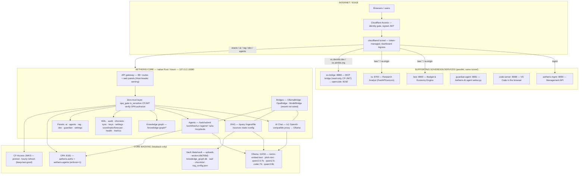

# Aetheris — Live System Blueprint (2026-08-11)

> **Rendered views:** [interactive HTML](aetheris_blueprint.html) · [PNG](aetheris_blueprint.png) · [PDF](aetheris_blueprint.pdf) · [SVG](aetheris_blueprint.svg) · source [diagram.mmd](diagram.mmd)

> **Basis:** this document is built from **live operational evidence** on the box
> (`ubuntu@147.224.174.50`, host `aetheris-free-tier`), not from repo documentation.
> Evidence collected 2026-08-11 via live `systemctl`, `ss`, `ps`, `/proc`, and HTTP probes;
> tunnel ingress from the Cloudflare API (oracle-aetheris tunnel, v26).
> **Diagram license:** Mermaid (renders on GitHub).

---

## 1. Host / OS (verified)

| Thing | Verified value |
|---|---|
| Host | `aetheris-free-tier` — Oracle Cloud Free Tier |
| OS | Ubuntu 24.04.4 LTS (Noble Numbat) |
| Kernel | `6.17.0-1019-oracle` (aarch64 / ARM64) |
| CPU / RAM | 4 cores / 23 GiB |
| Disks | `/` = sdb1 48G (23G used) · `/data` = sda **98G** (17G used) — **ext4, no ZFS** |
| Docker | installed (29.1.3) but **0 containers** — everything runs native |

---

## 2. System / block diagram — what Aetheris IS today

---

## 3. Request lifecycle / process flow (verified paths)

1. **Browser → Cloudflare Access** — identity check at the edge; a signed `Cf-Access-Jwt-Assertion` is injected.
2. **cloudflared tunnel** forwards to the loopback service the hostname maps to (ingress table below).
3. For core routes, **`opa_gate`** runs: if the route is *sensitive* (mutating verb, or GET of `/keys /audit /sync/download /dev/logs`), the core verifies the JWT (RS256, pinned JWKS, `iss` + `aud` ∈ 5-AUD set). A verified email is the **authoritative identity**; missing/forged → `unknown` → denied.
4. **OPA authorize** evaluates `aetheris.authz` (HTTP) or `aetheris.agents` (agent actions) with the effective role; under `OPA_ENFORCE=1` a denied decision → `403`.
5. Allowed requests dispatch to the feature engines, which call Ollama (embed/chat) + the vault (SQLite vectors / KG / WAL) as needed.
6. Results stream back through the tunnel; every decision is observable (`decision_logs.console`, metrics, audit/WAL).

### Tunnel ingress (ground truth, Cloudflare API)
| Hostname(s) | → loopback | Service |
|---|---|---|
| `oracle` `ai` `rag` `dev` `agents` | `127.0.0.1:8080` | Aetheris Core |
| `mgmt` | `127.0.0.1:9090` | aetheris-mgmt |
| `ra-origin`, `bee.*` | `127.0.0.1:8700` / `:8800` | ra / bee |
| `oc.devinfo.dev`, `oc.aimlds.org` | `127.0.0.1:8888` | oc-bridge (MCP) |
| *(core only surface: guardian/settings panels served by core under ai/dev hosts)* | | |

---

## 4. Services (systemd, all enabled + running — verified `systemctl`)

| Unit | Port | Role |
|---|---|---|
| `aetheris-core` | 8080 | Native Rust gateway + all feature engines + panels |
| `aetheris-agent` | 8081 | Aetheris AI sovereign agent surface (`guardian-agent/webui.py`) |
| `aetheris-mgmt` | 9090 | Management API (`mgmt.py`) |
| `opa` | 8181 | Open Policy Agent (policies in `/etc/aetheris/policy`) |
| `ollama` | 11434 | Local LLM/embedding runtime (v0.24.0) |
| `cloudflared` | tunnel | Edge ingress (token-managed) |
| `oc-bridge` | 8888 | MCP Streamable-HTTP bridge → opencode |
| `opencode` | 8192 | OpenCode HTTP API for oc-bridge |
| `bee` | 8800 | Budget & Economy Engine |
| `ra` | 8700 | Research Analyst (FastAPI/uvicorn) |
| `code-server` | 8088 | VS Code in browser (password auth) |
| `cf-access-jwks.timer` | — | Hourly CF-Access JWKS refresh (keep-last-good) |

---

## 5. Installed tooling (verified `command -v` / versions)

- **Native runtimes:** `aetheris-core` (Rust binary, `/opt/aetheris/bin/aetheris-core`), `opa` 1.1.0, `cloudflared` 2026.5.0, `opencode` 1.18.11, `ollama` 0.24.0, `code-server`, Python venvs (oc-bridge, bee, ra, guardian-agent, mgmt).
- **Explicitly ABSENT despite older docs:** `zfs`/`zpool` (storage is ext4), `nginx` (no reverse proxy), **0 Docker containers** (Docker engine present but unused by Aetheris), and **no rerank engine yet** (`llama-server`/`llamafile` not installed → `reranker_enabled=false`).

---

## 6. Verified features — TODAY

**Security / zero-trust**
- CF-Access edge identity + signed-JWT verification (RS256, pinned JWKS, 5-AUD set, hourly key refresh) — verified email is authoritative on sensitive routes
- OPA enforcement LIVE: HTTP authz (`aetheris.authz`) + per-role agent authz (`aetheris.agents`), method-aware `is_sensitive`, fail-closed on sensitive routes with `unknown` identity
- Loopback-only bindings (sole external ingress = tunnel) · audit/WAL + `metrics`/`health` endpoints · OPA decision logging

**AI / Chat**
- OpenAI-compatible `/v1/*` proxy → Ollama (`qwen2.5:7b` live chat default; `qwen3:8b`, `phi4-mini` also available) · model listing

**RAG (Document Q&A)**
- Ingest (`/ingest/file`, text/code formats incl. PDF→text-extract) → **nomic-embed-text** 768-dim → `vectors.db`
- Query with top-k retrieval, config (`GET/PUT /config`, partial-merge), `/sources`, `/stats`, `/sources/{name}` delete-with-cascade
- Embed-dim guard, rerank placeholder wired but **disabled** (no engine installed)

**Agents / orchestration**
- Planner → Researcher → Coder → Reviewer pipeline; `/task/submit`, `/workflow/run`, `/agents`, `/agents/status`
- OPA per-role action allowlists; in-process model invocation (no service-token needed)
- **A2A messaging** (`/a2a/messages`) · **MCP tools** (`/mcp/tools`, 9 tools)

**Data / ops**
- Knowledge graph (`knowledge_graph.db`), WAL (write-ahead log), Chronicle snapshots, audit log + replay
- Sync (upload/download), keys management, settings, coordinator circuits + orchestrator state/forecast
- Web panels (zero-JS HTML): ai · agents · rag · dev (API console, RAG config/test, system) · guardian · settings

**Supporting / parallel services**
- BEE (Budget & Economy), Research Analyst, Aetheris-mgmt, code-server, guardian-agent, oc-bridge MCP (read-only bridge over the local OpenCode HTTP API, CF-JWT gated)

---

*End of live blueprint. Corrections welcome — regenerate after any box change with the recon scripts in the session.*