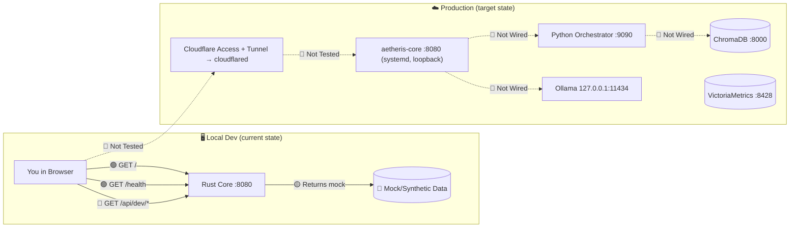
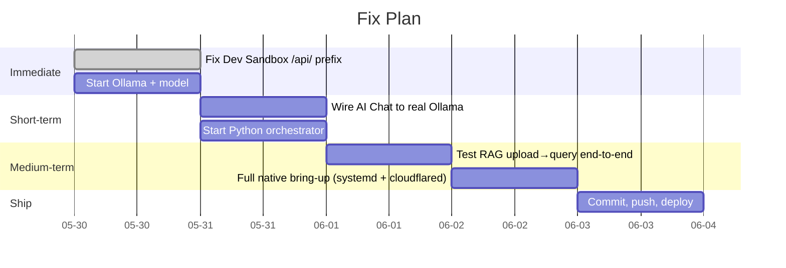

# Aetheris System Flow

## Legend
- 🟢 Working
- 🟡 Partial / Broken
- 🔴 Not Implemented

```mermaid
flowchart TB
    subgraph Browser["🌐 Browser (You)"]
        DB[("Dashboard (/web/)")]
        AI[("AI Chat (/web/ai/)")]
        AG[("Agents (/web/agents/)")]
        RAG[("RAG (/web/rag/)")]
        DEV[("Dev Sandbox (/web/dev/)")]
    end

    subgraph Core["🟢 Rust Core — Port 8080"]
        GW[("API Gateway")]
        HLTH[("🟢 /health")]
        STS[("🟢 /status")]
        
        subgraph DevAPI["Dev Sandbox API"]
            LOGS[("🔴 /api/dev/logs ❌ 404")]
            CFG[("🔴 /api/dev/config ❌ 404")]
            METR[("🔴 /api/dev/metrics ❌ 404")]
        end

        subgraph AgentAPI["Agent API"]
            ASTAT[("🟢 /agents/status")]
            ATASK[("🟢 /tasks")]
            AWRK[("🟢 /workflow/run")]
            A2A[("🟢 /a2a/messages")]
            MCP[("🟢 /mcp/tools")]
        end

        subgraph OrchestratorAPI["Orchestrator API"]
            OST[("🟢 /orchestrator/state")]
            OFC[("🟢 /orchestrator/forecast")]
            CCKT[("🟢 /coordinator/circuits")]
            KGE[("🟢 /knowledge-graph/*")]
        end

        subgraph RAGAPI["RAG API"]
            QRY[("🟡 /query → mock data")]
            SRC[("🟡 /sources → empty")]
            ING[("🔴 /ingest/file → no backend")]
            STAT[("🟡 /stats → zeroes")]
        end

        subgraph AIAPI["AI API"]
            MODL[("🟡 /v1/models → hardcoded fallback")]
        end
    end

    subgraph Python["🟡 Python Orchestrator — Port 9090"]
        RAGENG[("🔴 RAG Engine")]
        KGENG[("🔴 Knowledge Graph")]
    end

    subgraph Ollama["🟡 Ollama — 127.0.0.1:11434 (loopback)"]
        LLM[("🔴 qwen2.5:7b")]
        EMBED[("🔴 Embedding Model")]
    end

    subgraph Infra["🟢 Infrastructure"]
        CFD[("cloudflared (native)")]
        CF[("Cloudflare Tunnel + Access")]
    end

    %% Connections that work
    DB --> GW
    AI --> GW
    AG --> GW
    RAG --> GW
    DEV --> GW

    GW --> HLTH
    GW --> STS
    GW --> ASTAT
    GW --> ATASK
    GW --> AWRK
    GW --> A2A
    GW --> MCP
    GW --> OST
    GW --> OFC
    GW --> CCKT
    GW --> KGE

    %% Broken connections
    GW -.-x LOGS
    GW -.-x CFG
    GW -.-x METR
    GW -.-> QRY
    GW -.-> SRC
    GW -.-x ING
    GW -.-> STAT
    GW -.-> MODL

    %% Backends that are not running
    QRY -.->|"❌ Not Connected"| RAGENG
    ING -.->|"❌ Not Connected"| RAGENG
    MODL -.->|"❌ Not Connected"| LLM

    %% Production path (native): cloudflared → loopback core, gated by Access
    CFD --> CF
    CFD --> GW
```

## Data Flow Diagram

## What's Working vs What's Missing

### 🟢 Working Right Now
- Rust core compiles with 0 errors, 0 warnings; 39/39 unit tests pass
- All server routes register and respond (8080)
- Agent pipeline (Planner→Researcher→Coder→Reviewer) compiles
- A2A messaging, MCP tools, WAL audit log
- RAG pipeline live: upload → chunk → embed (nomic-embed-text) → SQLite vector store → generate (phi4-mini)
- Knowledge graph (entities/relations) populated from ingested documents
- Cloudflare Access + Tunnel routing all five hostnames (ai, rag, agents, dev, oracle) to core
- Web UIs served statically under `/web/`

### 🟡 Partial / Broken
- **Reranker**: Disabled by default — deployed Ollama 0.24.0 has no `/api/rerank` (falls back to vector-search order)
- **Dev Sandbox**: Was previously using `/api/*` prefix in production; all panels now use the same endpoints as the RAG panel
- **AI chat model**: qwen3:8b is slow on CPU (~150s); phi4-mini is the fast default

### 🔴 Not Working / Not Deployed
- **Python orchestrator (:9090)**: Not required — RAG/KG are native Rust; orchestrator proxy is optional
- **ChromaDB**: Replaced by the native SQLite vector store
- **code-server (:8443)**: Not deployed — the dev subdomain is an API console, not a VS Code sandbox
- **VictoriaMetrics**: Not running on the native deploy

## Quick Fix Priority

