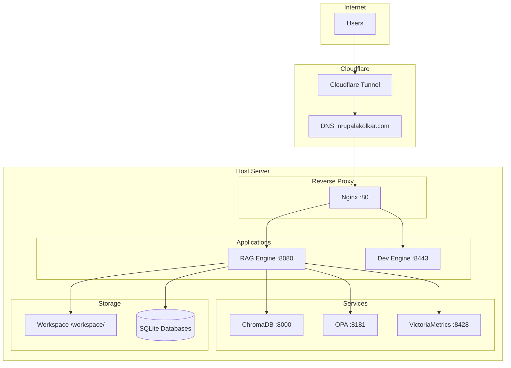
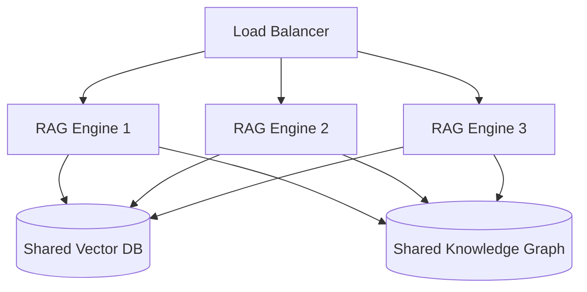

# Deployment Guide

## Overview

This guide covers deploying the Aetheris **RAG / LLMVM subsystem** in production, development, and local environments.

> **Deploying the Aetheris core?** The core is not deployed with Docker. After the
> Docker -> native cutover it runs as a native `systemd` service — install it with
> `sudo scripts/install-native.sh` and expose it via cloudflared + Cloudflare Access.
> See [`DEPLOY_NATIVE.md`](../DEPLOY_NATIVE.md) for the canonical core deployment. The
> Docker Compose stack documented below is the RAG / LLMVM container subsystem, which
> legitimately retains its own container runtime — it is not the core deploy.

**Target Platforms**: Ubuntu 22.04+, Debian 12 (RAG subsystem: Docker-enabled hosts; core: native systemd)  
**Minimum Resources**: 8GB RAM, 4 CPU cores, 50GB storage  
**Recommended**: 16GB RAM, 8 CPU cores, 200GB storage

---

## Architecture Overview



---

## Docker Compose Deployment (RAG / LLMVM subsystem)

### Step 1: Clone Repository

```bash
git clone https://github.com/nrupala/aetheris.git
cd aetheris
```

### Step 2: Configure Environment

Create `.env` file:

```bash
# RAG Configuration
AI_ENDPOINT=http://host.docker.internal:1234
AI_MODEL=microsoft/phi-4-reasoning-plus
EMBEDDING_MODEL=text-embedding-nomic-embed-text-v1.5

# Storage paths (host paths)
WORKSPACE_ROOT=/opt/aetheris/workspace
RAG_DB_PATH=/opt/aetheris/rag_data/vectors.db
RAG_GRAPH_DB_PATH=/opt/aetheris/rag_data/knowledge_graph.db

# Security
RAG_MAX_UPLOAD_MB=50

# Monitoring
VMETRICS_URL=http://aetheris_stats:8428
METRICS_ENABLED=true
```

### Step 3: Create Directories

```bash
sudo mkdir -p /opt/aetheris/{workspace,persisted/{audit,storage},rag_data}
sudo chown -R 1000:1000 /opt/aetheris
```

### Step 4: Start Stack

```bash
docker compose up -d
```

### Step 5: Verify

```bash
# Check all containers running
docker compose ps

# Health check
curl http://localhost:8080/health

# Check logs
docker compose logs -f rag
```

### Step 6: Configure Cloudflare Tunnel

```bash
# Tunnel ID from your Cloudflare dashboard
TUNNEL_ID="<your-cloudflare-tunnel-id>"

# The tunnel is already configured in compose.yaml
# Routes:
#   rag.nrupalakolkar.com → llmvm_rag:8080
#   dev.nrupalakolkar.com → llmvm_dev:8443
```

---

## Docker Compose Stack

```yaml
services:
  # RAG Engine — FastAPI with reasoning loop, KG, coordinator
  llmvm_rag:
    build:
      context: .
      dockerfile: Dockerfile.rag
    ports:
      - "8080:8080"
    volumes:
      - workspace:/workspace
      - rag_data:/app/rag_data
    environment:
      - AI_ENDPOINT=${AI_ENDPOINT}
      - AI_MODEL=${AI_MODEL}
      - WORKSPACE_ROOT=/workspace
      - VMETRICS_URL=http://aetheris_stats:8428
      - METRICS_ENABLED=true
    restart: unless-stopped
    healthcheck:
      test: ["CMD", "curl", "-f", "http://localhost:8080/health"]
      interval: 30s
      timeout: 10s
      retries: 3

  # Dev Engine — code-server for development
  llmvm_dev:
    image: lscr.io/linuxserver/code-server:latest
    ports:
      - "8443:8443"
    volumes:
      - workspace:/workspace
    environment:
      - PASSWORD=${DEV_PASSWORD}
    restart: unless-stopped

  # Nginx Reverse Proxy
  llmvm_nginx:
    image: nginx:alpine
    ports:
      - "80:80"
    volumes:
      - ./nginx/default.conf:/etc/nginx/conf.d/default.conf
    depends_on:
      - llmvm_rag
      - llmvm_dev
    restart: unless-stopped

  # Cloudflare Tunnel
  llmvm_tunnel:
    image: cloudflare/cloudflared:latest
    command: tunnel --no-autoupdate run --token ${CF_TOKEN}
    restart: unless-stopped

  # Vector Database
  aetheris_vectors:
    image: chromadb/chroma:latest
    ports:
      - "8000:8000"
    volumes:
      - chroma_data:/chroma/chroma
    restart: unless-stopped

  # Policy Engine
  aetheris_opa:
    image: openpolicyagent/opa:latest
    ports:
      - "8181:8181"
    volumes:
      - ./policies:/policies
    command: run --server --watch /policies
    restart: unless-stopped

  # Metrics Store
  aetheris_stats:
    image: victoriametrics/victoria-metrics:latest
    ports:
      - "8428:8428"
    volumes:
      - vm_data:/victoria-metrics-data
    restart: unless-stopped

volumes:
  workspace:
  rag_data:
  chroma_data:
  vm_data:
```

---

## Local Development (Non-Docker)

### Prerequisites

```bash
# Python 3.10+
python3 --version

# Install dependencies
pip install fastapi uvicorn chromadb sqlite3
```

### Start RAG Server

```bash
cd LLMVM

# Set environment variables
export AI_ENDPOINT=http://localhost:1234
export AI_MODEL=microsoft/phi-4-reasoning-plus

# Start server
python rag_cli.py server --host 0.0.0.0 --port 8080
```

### Run Tests

```bash
# Unit tests
python -m pytest rag_core/tests/ -v

# CLI tests
python rag_cli.py ingest docs/
python rag_cli.py query "What is WireGuard?"
python rag_cli.py stats
python rag_cli.py sources
```

---

## Production Hardening

### 1. Resource Limits

```yaml
services:
  llmvm_rag:
    deploy:
      resources:
        limits:
          memory: 4G
          cpus: '2'
        reservations:
          memory: 2G
          cpus: '1'
```

### 2. Health Checks

All services have health checks. Monitor via:

```bash
docker compose ps --format "table {{.Name}}\t{{.Status}}\t{{.Ports}}"
```

### 3. Backup Strategy

```bash
#!/bin/bash
# backup.sh — Daily backup script

BACKUP_DIR="/opt/aetheris/backups/$(date +%Y-%m-%d)"
mkdir -p "$BACKUP_DIR"

# Backup databases
docker cp llmvm_rag:/app/rag_data/vectors.db "$BACKUP_DIR/"
docker cp llmvm_rag:/app/rag_data/knowledge_graph.db "$BACKUP_DIR/"
docker cp llmvm_rag:/workspace/persisted/perf_metrics.db "$BACKUP_DIR/"
docker cp llmvm_rag:/workspace/persisted/system_events.db "$BACKUP_DIR/"

# Backup audit logs
cp -r /opt/aetheris/persisted/audit "$BACKUP_DIR/"

# Compress
tar -czf "$BACKUP_DIR.tar.gz" "$BACKUP_DIR"
rm -rf "$BACKUP_DIR"

# Retain last 30 days
find /opt/aetheris/backups -name "*.tar.gz" -mtime +30 -delete
```

### 4. Log Rotation

```bash
# Docker log rotation (in /etc/docker/daemon.json)
{
  "log-driver": "json-file",
  "log-opts": {
    "max-size": "10m",
    "max-file": "3"
  }
}
```

### 5. Monitoring Dashboard

VictoriaMetrics provides built-in dashboard at `http://localhost:8428`:

- Query metrics: `rate(aetheris_query_latency_ms_sum[5m])`
- Error rate: `rate(aetheris_errors_total[5m])`
- Resource usage: `node_memory_MemAvailable_bytes`

---

## Troubleshooting Deployment

### Container Won't Start

```bash
# Check logs
docker compose logs rag

# Common issues:
# - Port already in use: lsof -i :8080
# - Permission denied: chown -R 1000:1000 /opt/aetheris
# - Out of memory: docker stats
```

### Database Corruption

```bash
# SQLite WAL recovery
docker exec llmvm_rag sqlite3 /app/rag_data/vectors.db "PRAGMA integrity_check;"

# If corrupted, restore from backup
docker cp backup/vectors.db llmvm_rag:/app/rag_data/vectors.db
docker compose restart rag
```

### Network Issues

```bash
# Check container networking
docker network inspect aetheris_default

# Test connectivity between containers
docker exec llmvm_rag curl -f http://aetheris_vectors:8000/api/v1/heartbeat
```

---

## Scaling

### Horizontal Scaling (Future)



**Requirements for horizontal scaling**:
- Shared vector database (PostgreSQL with pgvector)
- Distributed Knowledge Graph
- Session affinity for stateful operations

### Vertical Scaling

Increase container resources:

```yaml
services:
  llmvm_rag:
    deploy:
      resources:
        limits:
          memory: 8G    # Increase from 4G
          cpus: '4'     # Increase from 2
```

---

## Environment Variables Reference

| Variable | Default | Required | Description |
|----------|---------|----------|-------------|
| `AI_ENDPOINT` | `http://localhost:1234` | Yes | LLM API endpoint |
| `AI_MODEL` | `microsoft/phi-4-reasoning-plus` | Yes | Chat model name |
| `EMBEDDING_MODEL` | `text-embedding-nomic-embed-text-v1.5` | Yes | Embedding model name |
| `AI_API_KEY` | — | No | API key for remote endpoints |
| `WORKSPACE_ROOT` | `/workspace` | No | Workspace directory |
| `RAG_DB_PATH` | `/app/rag_data/vectors.db` | No | Vector DB path |
| `RAG_GRAPH_DB_PATH` | `/app/rag_data/knowledge_graph.db` | No | Knowledge Graph path |
| `RAG_MAX_UPLOAD_MB` | `50` | No | Max upload size (MB) |
| `VMETRICS_URL` | `http://localhost:8428` | No | VictoriaMetrics URL |
| `METRICS_ENABLED` | `true` | No | Enable metrics collection |
| `AUDIT_LOG_PATH` | `/workspace/persisted/audit` | No | Audit log directory |
| `CHUNK_SIZE` | `512` | No | Text chunk size |
| `CHUNK_OVERLAP` | `64` | No | Chunk overlap |
| `TOP_K` | `5` | No | Retrieval top-k |
| `TEMPERATURE` | `0.1` | No | LLM temperature |
| `MAX_TOKENS` | `2048` | No | Max generation tokens |

---

## Upgrade Procedure

### Minor Upgrade (same major version)

```bash
git pull
docker compose build
docker compose up -d
docker compose logs -f rag  # Verify startup
```

### Major Upgrade (breaking changes)

```bash
# 1. Backup everything
./scripts/backup.sh

# 2. Stop services
docker compose down

# 3. Update code
git pull
git checkout v2.0.0  # or appropriate tag

# 4. Review migration notes
cat MIGRATION.md

# 5. Run migrations (if any)
docker compose run --rm rag python migrate.py

# 6. Start services
docker compose up -d

# 7. Verify
curl http://localhost:8080/health
python rag_cli.py query "test query"
```

---

## Uninstall

```bash
# Stop and remove containers
docker compose down

# Remove volumes (WARNING: deletes all data)
docker compose down -v

# Remove images
docker compose rm -f

# Remove local files
rm -rf /opt/aetheris
```
