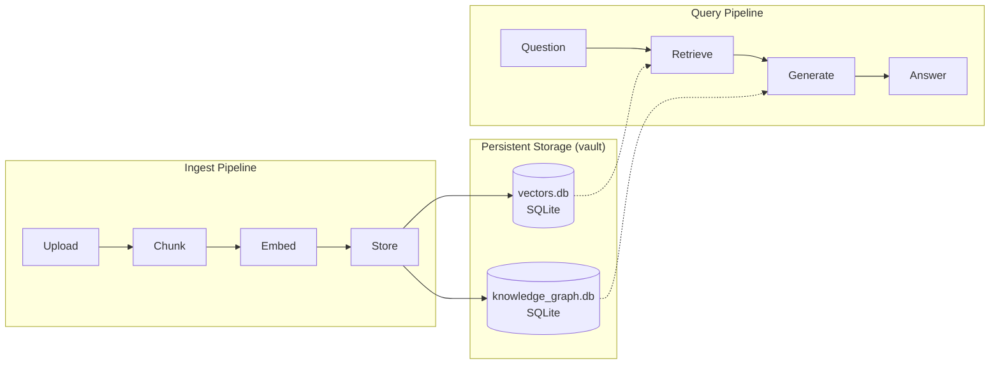

# RAG Pipeline — Complete Workflow

## Overview

The Aetheris RAG (Retrieval-Augmented Generation) pipeline transforms raw documents into an indexed knowledge base and answers questions against it with source citations. It is implemented **natively in Rust** inside Aetheris Core — there is no Python orchestrator or ChromaDB dependency.

**Components** (all in `core/`):

| Component | File | Responsibility |
|-----------|------|----------------|
| `TextChunker` | `core/src/rag.rs` | Splits documents into chunks |
| `VectorStore` | `core/src/rag.rs` | SQLite-backed vector index (normalized cosine search) |
| `KnowledgeGraph` | `core/src/kg.rs` | Entity/relation extraction on ingest |
| `OllamaBridge` | `core/src/implementation.rs` | Embeddings + LLM generation + optional reranking |
| RAG handlers | `core/src/main.rs` | HTTP endpoints (`/query`, `/ingest/file`, `/config`, `/sources`, `/stats`) |

---

## High-Level Architecture



```
Browser → Cloudflare Access → Cloudflare Tunnel → Aetheris Core (:8080)
  → Rust RAG pipeline
    → Ollama (:11434) — embeddings (nomic-embed-text) + generation (phi4-mini)
```

---

## Storage Layout

All RAG data lives under the vault directory (`VAULT_PATH`, default `/data/vault`):

| Path | Purpose |
|------|---------|
| `vectors.db` | Vector store — `chunks` + `embeddings` tables, WAL mode |
| `knowledge_graph.db` | Entity/relation graph |
| `rag_config.json` | Persisted RAG configuration (auto-loaded at startup) |
| `<uploaded files>` | Original uploaded documents (used for deletion) |
| `wal/` | Write-ahead audit log |
| `chronicle/` | Guardian snapshots |

The vector store schema uses `PRAGMA foreign_keys=ON` with embeddings referencing chunks via `ON DELETE CASCADE`, so deleting a source purges its vectors automatically.

---

## Ingest Workflow

### Step 1: Upload

`POST /ingest/file` (multipart `file=...`) — synchronous:

1. Extension check against `supported_ingest_ext` (text formats + PDF).
2. File written to the vault.
3. PDF → text extraction via `pdf_extract`; text files read as UTF-8.
4. `TextChunker` splits content into chunks.
5. Each chunk is embedded via Ollama (`/api/embeddings`, `nomic-embed-text`).
6. Chunks + embeddings inserted into `vectors.db` in one transaction.
7. Entities extracted into the knowledge graph.
8. WAL entry appended for the audit trail.

Response: `{"status", "files_uploaded", "chunks_indexed", "message"}`.

**Supported extensions**: `.txt .md .json .yaml .yml .csv .xml .html .htm .rs .py .js .ts .toml .pdf .c .h .cpp .hpp .cc .cxx .go` and other code files.

> **Embedding model is fixed.** The index must stay in one embedding space. `VectorStore.add_chunks` rejects vectors whose dimension differs from the existing index (default `nomic-embed-text`, 768-dim).

### Step 2: Chunking

`TextChunker` splits by paragraphs and packs into fixed-size chunks:

| Parameter | Default | Effect |
|-----------|---------|--------|
| `chunk_size` | 512 tokens | Larger = more context per retrieval, noisier |
| `chunk_overlap` | 64 tokens | Preserves context across chunk boundaries |

Each `Chunk` carries `text`, `source`, `index`, and `token_count`.

### Step 3: Embedding

`OllamaBridge.embed()` tries each configured embed model in order until one responds. On the production box this is `nomic-embed-text` (768-dim vectors, ~0.4s/chunk).

### Step 4: Storage

Vectors are L2-normalized and stored as packed float blobs. Search computes cosine similarity as a dot product over the normalized vectors. WAL journaling keeps the DB crash-safe.

---

## Query Workflow

### Step 1: Receive Query

`POST /query`:

```json
{
  "query": "What is the project structure?",
  "reasoning_enabled": false,
  "top_k": 5,
  "reranker_enabled": false
}
```

Only `query` is required; the rest default to the saved config.

### Step 2: Retrieve

1. Query text is embedded with the same model as the index.
2. `VectorStore.search` returns `top_k * 3` candidates by cosine similarity.
3. If `reranker_enabled` and the Ollama build exposes `/api/rerank`, candidates are re-scored and re-sorted. On older Ollama builds (e.g. 0.24.0) rerank returns 404 — the handler **falls back to vector-search order** and logs a warning.
4. Candidates are always truncated to `top_k` before prompting.

### Step 3: Generate

The prompt embeds each chunk as `[Source: <file>] (relevance: X)`, appends a code-context hint when the query looks like code, and asks the model to return **only valid JSON**:

```json
{ "answer": "...", "sources": [...], "confidence": 0.0-1.0, "reasoning": "..." }
```

Generation uses `query_model` (default `phi4-mini` on CPU) with a configurable timeout (`timeout_secs`, default 300s).

### Step 4: Return Answer

```json
{
  "query": "...",
  "answer": "...",
  "model": "phi4-mini",
  "sources": [{"source": "doc.pdf", "score": 0.82}],
  "confidence": 0.87,
  "top_k": 5,
  "chunks_searched": 5,
  "reranker_used": false,
  "took_ms": 1830
}
```

If the model returns unparseable text, the raw response is returned with `confidence: 0.5`. If generation times out or fails, the endpoint returns `503`.

### Reasoning Mode

`reasoning_enabled: true` asks the model to explain its thought process and include a `reasoning` field. This is **not** an iterative loop — there is no temperature annealing or self-verification in the Rust core.

---

## Configuration

Stored in `rag_config.json` (auto-created from defaults on first run; loaded at startup).

`GET /config` returns the current config. `PUT /config` accepts a **partial** object and merges it over the current config, so either panel (rag or dev) can save a subset:

```json
{
  "chunk_size": 512,
  "chunk_overlap": 64,
  "top_k": 5,
  "query_model": "phi4-mini",
  "reasoning_enabled": false,
  "embed_models": ["nomic-embed-text"],
  "reranker_model": "bge-reranker-v2-m3",
  "reranker_enabled": false,
  "timeout_secs": 300
}
```

> `reranker_enabled` defaults to **false** because the deployed Ollama 0.24.0 does not expose `/api/rerank`. Enable it only after upgrading Ollama to a build with rerank support and pulling `bge-reranker-v2-m3`.

---

## API Reference

| Endpoint | Method | Description |
|----------|--------|-------------|
| `/query` | POST | Ask a question against indexed documents |
| `/ingest/file` | POST | Upload + index a file (multipart) |
| `/sources` | GET | List indexed sources with chunk counts |
| `/sources/{name}` | DELETE | Remove a source (file + vector chunks) |
| `/stats` | GET | Knowledge base statistics |
| `/config` | GET / PUT | Read / merge-update RAG configuration |
| `/v1/models` | GET | List available Ollama models |
| `/knowledge-graph/stats` | GET | Entity/relation counts |
| `/knowledge-graph/entities` | GET | List entities |
| `/knowledge-graph/relations` | GET | List relations |
| `/coordinator/circuits` | GET | Circuit breaker states |

`/sources` only lists real indexed documents — sqlite artifacts (`vectors.db`, `*-wal`, `*-shm`, `rag_config.json`) are excluded.

---

## Operations Notes

- **CPU-bound**: On the 4-core production box, `phi4-mini` answers in ~2s once warm; first call pays a ~28s cold load. `qwen3:8b` (thinking) can take >150s — avoid for interactive RAG.
- **Deleting a source** removes the file from the vault and its chunks/vectors from the index (cascaded by the DB foreign key).
- **Backups**: copy the vault directory (or at least `vectors.db`, `knowledge_graph.db`, `rag_config.json`). SQLite WAL mode means you should checkpoint before copying (`sqlite3 vectors.db "PRAGMA wal_checkpoint(TRUNCATE);"`).
